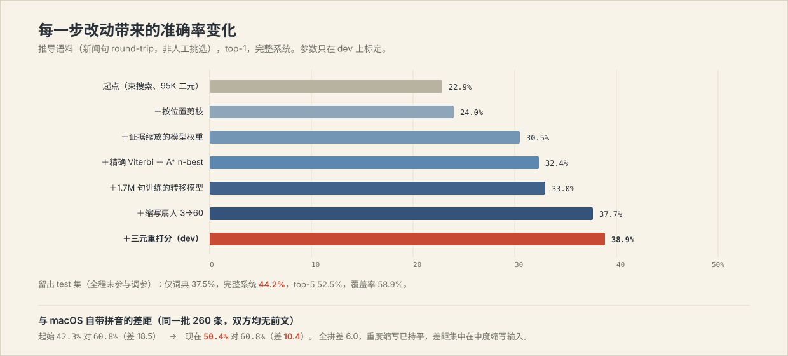

# Pinyin Input as Constrained, Context-Aware Ranking

**An exact lattice decoder and a local 0.6B re-ranker, measured against a derived corpus and against the system input method**

BiLing project report · 2026-07-27
Repository: <https://github.com/shoal-rat/BiLing>

---

## Abstract

Pinyin-to-character conversion is usually built either as a lexicon lookup
reordered by n-gram frequency, which is fast but blind to what the user is
writing, or as generation by a large language model, which understands
context but costs a network round trip per keystroke. We take a third
position: conversion is *ranking over a phonetically closed set*, so a
0.6-billion-parameter model running locally is sufficient, and because the
candidate set is produced deterministically the model can sit off the
keystroke path entirely and be allowed to fail.

This report describes the system and, more importantly, what measuring it
honestly did to it. Three findings dominate. First, a hand-written test
corpus overstated accuracy by a factor of 2.4 relative to one derived from
real news text; the derived corpus became the only number we trust.
Second, once measured properly, the bottleneck was never scoring —
82% of answers that appear anywhere in the candidate list already rank
first — but *candidate generation*, which sent us to replace beam search
with exact Viterbi plus backward A\* n-best extraction, a change that
improved accuracy and reduced latency simultaneously. Third, benchmarking
against macOS's own Simplified Chinese input method showed it comfortably
ahead of us, and closing that gap, rather than defending a number, set the
rest of the agenda.

On a held-out test split of 1,761 derived items the deterministic layer
reaches 37.5% top-1 at 8.6 ms median, and the full system 44.2% top-1 /
52.5% top-5 at 50 ms. Against Apple Pinyin on 260 identical items we are
at 50.4% to its 60.8%; over the work described here that gap narrowed from
18.5 points to 10.4, with heavily abbreviated input now level. Every
number below is reproducible from the repository.

**Part II (2026-07-29)** extends the system along the one axis Part I
identified as cheapest: committed context. The deterministic decoder now
conditions on the last committed word directly (a promotion-only
substitution for the sentence-start marker), personalization becomes a
Bayesian evidence model over the user's own selections and word
transitions, and the fixed invocation margin becomes a pair of calibrated
logistic gates. The result, measured pairwise with both systems reading
the identical committed context: statistical parity with Apple Pinyin on
150 held-out general-text items (77.3% vs 77.3%), and a significant lead
on a 43-item context-disambiguation corpus (83.7% vs 67.4%, paired
difference +16.3 points, 95% CI [+2.3, +30.2]). Cold start, Apple still
leads. Held-out full-system accuracy rises to 46.1% with context while
the model now runs on under two-thirds of keystrokes.

以下正文为中文。

---

## 1. 问题设定

拼音转汉字（P2C）的经典表述：给定按键串 $x$ 与光标前已有文本 $h$，求

$$\hat{c} = \arg\max_{c \,\in\, C(x)} \; P(c \mid x, h)$$

关键性质是候选集 $C(x)$ **封闭且可枚举**——合法候选必须与 $x$ 的某种音节
切分逐段对齐。这把任务从"生成"降级为"排序"：模型不需要会写文章，只需要在
几十个音同候选里判断哪个贴合前文。分支因子被拼音约束削掉数个数量级，这正是
0.6B 模型够用的原因，也是本文的立论基础。

由此分解出两个子问题，本文分别对待：

1. **覆盖率**：$C(x)$ 必须包含用户想要的那一个（§2、§3）；
2. **排序**：在 $C(x)$ 内部把它排到第一（§4）。

工程上的核心取舍是：子问题 1 由确定性组件负责，必须永远、快速地给出完整
候选；子问题 2 才交给模型，允许它慢、允许它缺席。模型崩溃、未加载或被内存
压力回收时，输入法仍然可用，只是排序退回词频序。§6 会说明，**真正限制准确率
的一直是子问题 1**，这与直觉相反，也是本项目最重要的一条经验。

## 2. 候选生成：格的构造

### 2.1 切分格

按键串解析为音节格，保留全部切分歧义：`xian` 同时是 `xian`（先）与
`xi'an`（西安），`fangan` 同时是 `fang'an`（方案）与 `fan'gan`（反感）。
撇号强制断音。不做贪心切分——歧义交由排序层消解。

### 2.2 词典与扇入

完整键查 1,440,094 条只读 SQLite 索引（主键 `(key, text)`，常驻预编译语句）。
每个起点位置沿键逐步加长前缀查询，取每个键的前 6 条。

一次针对词库的 oracle 分析给出了扇入的意义：**正确的词有 98.5% 的时间就在
词库里**。扇入从 3 提到 6 使覆盖率 +0.7 个百分点，代价 0.7 ms；再往上（10、
12）收益迅速消失，因为约束转移到了搜索本身（§3）。

### 2.3 缩写码

真实的快速输入不会逐字母写全。词库为每个词条预存两个附加码：

| 码 | 定义 | 例 |
|---|---|---|
| `abbrev` | 全部声母 | 大学 → `dx`，吉林大学 → `jldx` |
| `mixed` | 首音节全拼 + 其余声母 | 没有 → `meiy`，空调 → `kongt` |

两者各建 `(码, 权重)` 复合索引，使"按词频降序取前 k"成为免排序的索引扫描。
词级组合即可覆盖真实输入：`jilin·dx·meiy·kongt` = 吉林·大学·没有·空调。

**扇入是这里的决定性参数，而这只有测量才能发现。** 一次审计显示，缩写测试
项里 **95.6% 的词都能被某个已存的码检索到**——词库从来不是瓶颈。瓶颈是搜索
只取每个缩写码的前 3 条，而两字母码往往被上千个词共享。把该上限扫到 60，
覆盖率从 44.6% 升到 53.9%：

| 缩写扇入 | 3 | 8 | 16 | 28 | 40 | 60 | 90 |
|---|---|---|---|---|---|---|---|
| 覆盖率 | 44.6% | 48.7% | 51.2% | 52.5% | 53.2% | **53.6%** | 53.6% |
| 中位延迟 | 3.9 ms | 4.4 | 4.9 | 5.5 | 6.5 | 7.2 | 8.5 |

代价只落在缩写输入上：整条缩写路径以"整串不能被完整切分为拼音"为前提，
纯拼音输入的延迟没有变化（3.8 ms）。这条门控取自 librime——它在存在完整
拼写时会把缩写边从音节图里整个删除——也是 `fan` 永远是 饭、`shanghai`
（同时是英文词）永远是 上海 的原因。

### 2.4 句中拉丁词

英文词可以出现在句子中间而不只是结尾（`economicslajizhuanye` →
economics 垃圾专业，`yongvscodexiedaima` → 用 VS Code 写代码）。同样以
"整串不可切分为拼音"为门控；此外，本身能读作拼音的字母串归中文，除非它是
精选词条——`jing` 在英文词表里，但在 北京还有 中它是 北京 的尾巴。

### 2.5 一个实现陷阱，值得单独记录

`mixed` 索引建为部分索引（`WHERE mixed <> ''`，因单音节词的 `mixed` 与 `key`
重复）。若查询写作 `WHERE mixed = ?`，SQLite 无法证明 `? <> ''`，于是**放弃
索引、全表扫描 144 万行**——单次查询约 12 ms，整句退化到 3035 ms。补上
`AND mixed <> ''` 后回到 14.2 ms，**214× 差距，仅因谓词写法**。

## 3. 精确解码：Viterbi + 反向 A\*

### 3.1 束搜索为何不够

早期实现是束搜索：每个位置保留最好的若干条部分路径，指望正确的那条在其中。
这在格最宽时失效——长句，以及缩写，那里每个键都匹配许多词——因为正确路径可能
在早期被局部更优的对手挤掉，且再也回不来。

实测支持这一判断，也否定了"加宽就好"的直觉：

| 改动 | 覆盖率 | 中位延迟 |
|---|---|---|
| 每位置束宽 12（基线） | 38.4% | 4.5 ms |
| 每位置束宽 20 | 38.8% | 5.2 ms |
| 按 (位置, 上一个词) 状态剪枝，每状态 2 条 | **36.1%**（更差） | 4.7 ms |

### 3.2 两趟精确解码

改为 libime 的形式，也是格解码的标准做法：

1. **前向 Viterbi。** 计算每个状态的精确最优分。二元模型下状态是
   (位置, 上一个词) 而非位置本身，因为下一个词的分数依赖上一个词。
2. **反向 A\*。** 从终点向前走，按 $f = g + \mathrm{fwd}[\text{state}]$ 排序
   部分后缀，其中 $g$ 是已累积的后缀分。前向分是**精确的**最优补全，因此启发
   函数完美：A\* 按分数严格递减弹出完整路径，前 K 条就是模型下真正的前 K 条。

交给重排器的 n-best 因此是**构造上正确有序**的，而不是碰巧有序。这正是长句
可用的前提。**精确反而更快**，因为不再为注定出局的路径付出代价：

| | 束搜索 | 精确解码 |
|---|---|---|
| top-1（dev，仅词典） | 25.2% | **26.8%** |
| 覆盖率 | 39.1% | **44.3%** |
| 中位延迟 | 4.4 ms | **3.2 ms** |
| p95 延迟 | 20.6 ms | **9.9 ms** |

n-best 规模在 dev 上扫到 80（覆盖率在此走平）。每位置保留的 LM 状态上限为
24：精确性是逐状态的，该上限只限制同一位置上存活多少个不同的"上一个词"。

## 4. 打分：一个尺度

### 4.1 先前设计为何失败

早期版本里每个候选来源各有一套自造分数：整词命中用
`log1p(weight) + 词长奖励 + 整词奖励`，缩写用 `log1p(weight) + 10`，句子用
`束分数 / 段数 + 2`，字面串用常数 `18` 或 `100`，学习项用 `24 + log1p(c) × 4`。
量纲互不相通，于是每修一个 case 就要发明一个新常数，而新常数又破坏旧 case。
在实现混合语言与缩写输入时该模式直接崩溃：为让某个例子通过而调参，反而使
`vscode` 崩溃、`ai` 退化成字面串。**根因不是常数取值不对，而是根本不存在
可比的尺度。**

### 4.2 统一的对数概率模型

所有候选现在都是同一生成故事下的对数概率：用户选定了一串词，并以某种形式
键入每一个。

$$\text{score}(\text{path}) = \sum_i \Big[ \log P(w_i \mid w_{i-1}) + \log P(f_i) \Big]$$

书写形式的先验为 $P(\text{全拼}) = 0.80$、$P(\text{混合}) = 0.13$、
$P(\text{纯声母}) = 0.07$。三个此前需要显式规则的性质自动成立：

- **段数少者胜。** 每多一段就多付一次 $-\log(\text{总权重})$，于是
  北京 + 还有 自然击败 被 + 尽管 + 还有，无需"优先长词"规则；
- **缩写是回退而非平级。** 只要存在写全的读法，写全者胜；没有全拼读法时，
  缩写读法仍胜过无解；
- **拉丁词平等参赛。** 经同一 unigram 模型以伪词频入场（写全 20 000、精选表
  展开 6 000、系统词典猜测 300），而非绝对概率——后者会让任意英文词压过所有
  中文词。

**不再除以段数。** 对数概率之和已是整条路径的概率；除以段数恰好抵消掉分词
所依赖的长度偏好。这是旧实现中一个隐蔽而致命的错误。

字面串建模为"想要拉丁输出的先验 × 字母的均匀模型"：
$\log P = \log(0.005) + n \log(1/26)$。长度项是关键——单一常数无法同时做到
"短乱码串仍可上屏"与"长句面前毫无胜算"。先验 0.005 由 dev 扫描确定
（0.02 → 75.0%，0.005 → 76.4%，更低进入平台期）。

### 4.3 词间转移模型

把切分看作独立词的乘积，无法区分 中国工程院·院士 与 中国工程·远远失望——
两者都是"一串各自合理的词"。加入二元转移（Jelinek-Mercer 插值）：

$$P(w_i \mid w_{i-1}) = \lambda \cdot P_{\text{bi}}(w_i \mid w_{i-1}) + (1-\lambda) \cdot P_{\text{uni}}(w_i)$$

未见过的转移精确退化为原行为。$\lambda$ 在 dev 上扫描为 0.40。

**训练数据规模的影响是可观的。** 从 10 万句（95K 转移）扩到 169 万句
（629K 转移，四个 Leipzig 语料合并）：dev 仅词典 top-1 26.8% → 27.9%，缩写类
13.3% → 15.9%。**与评测语料重合的 5,269 句已剔除**——该重合是真实存在的
（1.3%），不剔除会直接虚高。

### 4.4 三元重打分

三元上下文用于**对已完成的 n-best 重打分**，而不进入 Viterbi 状态（那会使格
规模倍增）。这是语音解码的常规安排：用紧凑模型搜索，用更丰富的模型重排。

第一次尝试重算整条路径的分数，**收益为零且延迟 65×**——它丢掉了书写形式代价
（缩写的价钱），又对每个词做一次 SQL 查询。改为只对语言模型项计算**增量**、
并把词权重从解码器一路带出后，密度成为关键：min-count 8 时只剩 12.4 万条三元
（观察到 739 万条，剪掉 98%），毫无作用；放宽到 min-count 2 得到 122 万条，
才有 +0.9 个百分点。$\gamma$ 扫描为 0.15。

### 4.5 个性化与模型混合

用户为某个键选过的词，其对数概率锚定在**语料中最高词频**上，因此一次有意的
选择至少与最常见读法等价——这正是"改一次，下次就记住"的来源。

模型分数与词典分数按对数线性混合，且**权重随可用证据缩放**：

$$\lambda(x) = 0.55 \cdot \frac{e}{e+1},\qquad e = (L_{\text{cand}} - 1) + 2 \cdot \mathbb{1}[\text{有前文}]$$

理由不是调参：**词典已经从远大于 0.6B 模型的语料里学到了 unigram**；模型能
提供而词典不能的，只有*条件*结构——候选如何接续前文、候选内部如何接续。一个
没有前文的单字候选，这种证据为零，此时模型没有投票权。另加一条单调保护：模型
只能**提升**它比词典首选更认可的候选，不能把词典首选任意压低
（$\Delta = \max(0, s^{LM}_c - s^{LM}_{\text{词典首选}})$）。

这两条把此前"模型让单音节与纯拉丁键变差"的负收益消掉了：单音节类
87.5% → 100%。

## 5. 评测方法

### 5.1 作者语料的偏差

最初的 72 条语料由作者手写。**手写语料测量的是作者已知系统能做对的事**，
选择偏差不可避免。

### 5.2 推导语料

为消除该偏差，另建一套语料，测试项由一个本系统未参与的过程生成：

1. 句子取自公开新闻语料（Leipzig Corpora Collection, zho_news_2020_10K）；
2. 由 **jieba** 分词、**pypinyin** 注音——两者都不知道本系统词库的存在；
3. 按键串从 §4.2 的**书写形式先验中采样**，即模拟真实的缩写打字；
4. 按句子哈希分 dev / test，参数只在 dev 上标定，test 只跑一次。

共 3,387 条，五种条件：`full`（整串全拼）、`abbrev`（轻度缩写）、
`abbrev-heavy`（重度缩写）、`full-ctx` 与 `abbrev-ctx`（前半句作为已有前文，
只转换后半句）。语料本身不入库（第三方文本、各自许可），
`scripts/build_eval_corpus.py` 按需下载并以相同 `--seed` 精确复现。

### 5.3 两套语料的差距

| 语料 | top-1 |
|---|---|
| 作者手写（72 条） | 86.1% |
| **推导（留出 test，1761 条）** | **44.2%** |

**作者语料高估了近一倍。** 这是本报告最重要的一条方法学结论，也是任何只在
自建示例上验证的输入法工作都应当自查的。

### 5.4 指标

top-1 / top-5 准确率、MRR，另加**覆盖率**（正确答案是否出现在候选列表任意
位置）。覆盖率把两类需要相反修法的失败分开：候选根本没被生成是搜索/词库问题，
生成了但排得低是打分问题。

## 6. 结果



### 6.1 消融（推导语料，留出 test，n = 1761）

| 条件 | top-1 | top-5 | 覆盖率 | MRR | 中位延迟 | p95 |
|---|---|---|---|---|---|---|
| 仅词典 | 37.5% | 48.7% | 58.9% | 0.428 | 8.6 ms | 42.0 ms |
| **完整系统** | **44.2%** | **52.5%** | 58.9% | **0.477** | 50.1 ms | 103.2 ms |

本地模型贡献 +6.7 个百分点。

### 6.2 分条件结果（留出 test）

| 条件 | n | 仅词典 top-1 | 完整 top-1 | 覆盖率 | 完整 top-5 |
|---|---|---|---|---|---|
| `full` 整串全拼 | 412 | 45.4% | **52.9%** | 70.1% | 63.8% |
| `full-ctx` 全拼 + 前文 | 401 | 60.6% | **66.1%** | 76.8% | 73.3% |
| `abbrev` 轻度缩写 | 310 | 25.2% | **33.2%** | 51.0% | 42.3% |
| `abbrev-ctx` 缩写 + 前文 | 236 | 39.0% | **50.0%** | 64.4% | 55.1% |
| `abbrev-heavy` 重度缩写 | 402 | 15.2% | **18.4%** | 32.6% | 26.6% |

两条规律清楚：**前文一致地值 5–11 个百分点**（`full` 52.9 → `full-ctx` 66.1；
`abbrev` 33.2 → `abbrev-ctx` 50.0），且缩写越重、模型越难补救。

### 6.3 覆盖率是天花板

完整系统 44.2% 对覆盖率 58.9%——凡是候选里存在正确答案的，**75% 已经排在
第一**。打分已相当好；剩余失败几乎全部是"正确答案根本没被生成出来"。这条
诊断决定了本轮所有工作的优先级：先修生成，再修排序。

### 6.4 与 macOS 自带拼音的对比

Apple 未公开其转换器的 API，因此唯一诚实的测法是像人一样驱动它：选中输入源、
向真实文本视图投递按键事件、空格上屏、读回落在视图里的文本
（`scripts/apple_baseline.swift`）。**在两个测量脚本的 bug 修好之前，这个对比
是没有意义的**——事件泵在队列一空就返回而不等待输入法转换，且长输入需要多次
上屏；修复前 150 条里有 114 条毫无输出，会被误读成 Apple 失败。

同一批 260 条，双方均无前文：

| 类别 | n | Apple | 笔灵 | 差 |
|---|---|---|---|---|
| `full` | 150 | **65.3%** | 59.3% | −6.0 |
| `abbrev` | 100 | **57.0%** | 39.0% | −18.0 |
| `abbrev-heavy` | 10 | 30.0% | 30.0% | ±0.0 |
| **合计** | 260 | **60.8%** | **50.4%** | **−10.4** |

**Apple 仍然领先。** 本轮工作把差距从 18.5 个百分点缩到 10.4，重度缩写已经
持平，剩余差距集中在中度缩写输入。

需要说明两点，且都作为限定而非辩解：其一，这是**无前文**对比，而读取文档中
已有文本正是本系统区别于系统输入法之处——带前文时 `full` 从 52.9% 升到
66.1%——但本次没有给 Apple 同样的条件，因此不构成任何主张；其二，语料是新闻
文本，正是通用输入法的主场。

## 7. 误差分析

留出 test 上完整系统的失败，按成因：

- **覆盖缺失（约 56% 的失败）**：正确答案不在候选中。集中在重度缩写
  （覆盖率仅 32.6%）与长新闻句。
- **同音虚词**：的/得/地、在/再、个/给。词频上几乎不可分，需要更强的上下文
  建模；有前文时明显缓解。
- **专名**：新闻文本里的人名地名（陈定、婆沙）在通用词库中缺失。词级审计显示
  仅 5.8% 的词完全不在词库，但其中多数正是专名。
- **缩写歧义**：`dx` 同时是 大学 与 东西 的声母码，`tq` 同时是 天气 与 提前。
  正确答案常落在第 2–5 位，即用户需翻页一次。

## 8. 与已发表结果的对齐

| 系统 | 规模 | 全拼 P@1 | 全简拼 P@1 | 备注 |
|---|---|---|---|---|
| Google IME（PinyinGPT 论文基线） | — | 70.9 | — | PD 数据集 |
| PinyinGPT-Concat | GPT-2 级 | 73.2 | ~28 | 公开基准 |
| GeneInput | 2.6B + RLHF | 88.4 | **67.0** | 8×A100 一周，且使用自家输入法真实日志（同域） |
| CNMBERT | BERT-wwm + MoE | — | MRR@1 51.9 | 专攻简拼，多掩码策略 |
| **笔灵** | **0.6B，无同域日志** | **52.9**（新闻长句） | **18.4**（重度）/ 33.2（轻度） | 端侧，50 ms |

两点由此确定：

1. **缩写输入的天花板高度依赖训练规模与同域数据。** 文献里从 ~28% 跳到 67%
   靠的是两个数量级的算力、真实输入法日志的同域监督，以及针对按键前缀集的
   约束解码——没有一项是调打分常数能换来的。
2. **上下文是最便宜的收益，且被独立复现。** PinyinGPT-Concat 仅把左侧上下文
   从 0–3 词加到 4–9 再到 10+，P@1 就从 31.72 → 50.78 → 59.89。本文数据同向：
   `full` 52.9% 对 `full-ctx` 66.1%。真实打字本来就是短跨度、带前文的。

## 9. 系统开销

| 项 | 实测 |
|---|---|
| 输入法进程（未开始输入） | 29.6 MB |
| 引擎进程（n-gram 已载入） | 124 MB |
| 守护进程（模型已载入） | 620 MB，其中约 400 MB 为 mmap 干净页 |
| 守护进程空闲 10 分钟后 | ≈ 6 MB（整体卸载） |
| 纯拼音同步延迟 | 3.8 ms 中位 / 7.8 ms p95 |
| 缩写输入同步延迟 | 15–20 ms 中位 |

1.85M 条 n-gram 若以拼接字符串为键需 215 MB；改为 64 位 FNV-1a 哈希为键后降至
124 MB，结果逐条一致（该规模下碰撞概率约 10⁻⁷，代价是某一个候选被错误定价，
而非正确性受损）。

空闲成本按设计趋近于零：无任何定时器（不做周期健康检查、不轮询状态），模型
懒加载并在空闲 10 分钟后整体卸载，低电量模式自动把会话让给系统拼音。

## 10. 局限

- **落后于系统输入法 10.4 个百分点**，差距集中在中度缩写输入。
- **重度缩写覆盖率仅 32.6%**，是最大的单一短板。
- **语料为单一来源、单一领域**（新闻）。round-trip 生成依赖 pypinyin 的读音
  正确性；多音字读错会使"正确答案"本身不可达。
- ~~前文对比未覆盖 Apple~~（第二部分 §17 已补齐：配对、双向、含置信区间）。
- **LoRA 个性化的训练数据是选择记录**（短语级）而非完整语句流，这是隐私设计的
  直接后果（系统不存储句子），个性化上限相应受限。
- 三元模型的收益（+0.9）相对其内存代价偏小，是可以被更好方案取代的一环。

## 11. 复现

```bash
swift test                                                     # 26 项单元测试

# 推导语料（自动下载源语料，--seed 决定内容）
python3 scripts/build_eval_corpus.py --fetch --limit 800

# 四个条件
.build/release/biling-cli --evaluate Tests/Corpus/derived-test.tsv --engine-only --no-context
.build/release/biling-cli --evaluate Tests/Corpus/derived-test.tsv

# 与系统输入法对比（需要辅助功能权限，会接管键盘数分钟）
swift scripts/apple_baseline.swift Tests/Corpus/derived-test.tsv 300

# 带前文的配对对比 + 逐条配对自举（第二部分 §17）
.build/release/biling-cli --evaluate Tests/Corpus/contrast.tsv --per-item biling.tsv
swift scripts/apple_baseline.swift Tests/Corpus/contrast.tsv 43 --context > apple.tsv
python3 scripts/paired_bootstrap.py biling.tsv apple.tsv

# 转移模型（剔除与评测语料重合的句子）
python3 scripts/build_bigrams.py --source … --exclude … --lexicon …
```

原始输出保存在 [`Docs/results/`](results/)。


---

# 第二部分：把前文变成一等公民（2026-07-29）

第一部分结束时留下两个事实：Apple 拼音冷启动领先 10.4 分；而文献与我们自己的
消融都说，前文是最便宜的收益来源（PinyinGPT 的 P@1 随左侧前文从 31.7 涨到
59.9，我们自己的全拼条件从 48.8 涨到 64.1）。第二部分做的事情可以用一句话
概括：**把前文从"给大模型的提示"提升为"整个概率模型的条件"**，并沿途把
每个手调常数换成有据可依的估计。

## 12. 上下文条件化：替换句首标记

第一部分的解码器从一个句首标记 $\langle s\rangle$ 出发；二元表里没有任何以
$\langle s\rangle$ 为条件的行，于是每个首词都退化到一元先验。但输入法明明
知道光标前刚提交了什么。设前文尾词为 $w_0$（对已提交文本做最长后缀词典匹配，
仅当光标紧跟汉字时存在），解码起点改为 $w_0$：

$$P(w_1 \mid \text{start}) \;=\; \lambda\, P(w_1 \mid w_0) + (1-\lambda)\, P(w_1)$$

这正是格内每一条转移在用的 Jelinek–Mercer 插值（$\lambda=0.40$），没有引入
任何新尺度。对整键候选（词典整词、简拼），等价的修正以增量形式写出：

$$\Delta = \log\!\left(1 + \tfrac{\lambda}{1-\lambda}\, \tfrac{P(w\mid w_0)}{P(w)}\right) \;\ge\; 0$$

**只升不降**：语料没见过的搭配 $\Delta=0$，分数一字不动；空前文与非汉字前文
逐字节等价于旧行为。代价接近于零——一次尾词查询加一次哈希查表（期间踩了一个
老坑的新变体：按 text 查词权重的语句没有索引，全表扫过 144 万行，单次 74 ms；
建索引后 1.3 ms）。

单靠这一步，43 条前文歧义对照集上确定性层从 41.9% 涨到 48.8%（走进→教室、
我们的→教师），延迟不变。一个诚实的细节被测试钉住：在有限状态束（每位置 24
态）下，被提升的竞争者可能把某条尾部路径挤出束外，因此"只升不降"对句子候选
只在路径级成立，对列表级不成立——这写进了测试注释而不是被掩盖。

## 13. 个性化：证据而非开关

第一部分的学习是"选过就加分"，一个 $\tau=200$ 的指数衰减管一切。第二部分把
它拆成一个可辩护的模型：

**多时间尺度记忆。** 每个 (拼音, 选择) 对维护三个指数滑动计数
（$\tau=50/500/5000$ 次选择），读取时取平均。指数混合近似幂律遗忘：早上刚选
的压过上个月的习惯，但几个月的习惯挺得过一周不用——单一 $\tau$ 做不到两头。

**用户转移证据。** 提交整句时，句内相邻词对写入用户二元表，解码时与语料
条件概率做证据加权插值：

$$P'(w'\mid w) = (1-\mu)\,P_{\text{corpus}}(w'\mid w) + \mu\,P_{\text{user}}(w'\mid w),\qquad \mu = \min\!\left(0.7,\; \tfrac{n_w}{n_w+40}\right)$$

投票权是挣来的：跟在 $w$ 后面提交过 40 次，用户模型才拿到一半话语权；上限
0.7 保住语料的平滑地位，防止自我反馈。新档案 $\mu=0$，行为逐字节不变——这条
不变量由金标准测试持有。

**存储。** v1 的去重约束 `UNIQUE(pinyin_hash, text_cipher)` 从未生效过——
AES-GCM 密文带随机 nonce，同一明文两次加密永不相等，去重实际靠每次记录时
解密全部同键行逐一比对。v2 存明文的带密钥 HMAC：约束真实生效，每次更新是一条
带索引的语句，而拿到数据库文件的人在没有钥匙串密钥时依旧一无所得。迁移在一个
事务内完成，并重算拼音哈希的域前缀——不重算的话，每条旧记录都会静默变成
永远查不到（迁移可达性测试就是为此存在）。事件日志加密落盘，是拟合打字
信道先验的唯一非循环数据源（推导语料的键形是从当前先验采样的，用它拟合
等于把先验洗一遍再当测量——拟合脚本拒收语料输入并说明原因）。

## 14. 校准的门控：P(第一名是错的)

固定 3.0 nat 边距只问一个问题：领先多少。列表知道的更多：领先者之下概率质量
怎么摊、多少候选挤在缝里。对每个列表取特征
$[\text{margin}, H(\text{top8}), \text{spread}_5, \log n]$，用留出教师列表拟合
逻辑回归估计 $P(\text{top-1 错})$：Brier 0.143 对基线 0.231（冷）、0.145 对
0.227（有前文）。

为什么要两套参数：前文提升会锐化边距，用冷启动校准去判断带前文的列表，会把
"看起来定了"当成"真的定了"——对照集上量出 7 分白丢在错误的跳过上。分双模式
校准、双阈值（冷 0.35 / 前文 0.15）后：两种模式都打平旧边距规则的准确率，
调用量分别降到它的 66% 与 74%。留出测试集上模型只在 62.5% 的按键上运行。

## 15. 蒸馏的失败，如实记录

计划是把 Qwen 的排序判断蒸进一个几百参数的 MLP（12 维特征 → 16 隐层 → 1），
教师信号为 8,829 个列表上每候选的对数概率，混合目标 = 标注正例的 listwise
交叉熵 + 对教师 softmax 的 KL。结论：在每个 $(\alpha, T)$ 网格点上，留出集
增益都在 $1.96\sigma$ 以内（最好 +0.24 分 = 一条列表）。12 维手工特征装不下
教师的文本级知识——这是瓶颈本身，不是训练技巧问题。训练脚本现在拒绝导出
统计不显著的模型；Swift 侧前向通路（加载、校验、只升不降混合）作为休眠
基础设施随包发布并被测试覆盖。**拒绝就是结果**：它和第一部分线性 ranker 的
拒绝一起，划出了"这 12 维特征还能榨出什么"的边界。

## 16. 正确性顺带的收获：重新扫定融合权重

桥接层修正（合并分词：候选与前文拼接后整体分词，只给分歧后缀计价——旧路径
跳过了候选首 token 的概率）改变了模型分数的语义与尺度。融合上限随之重扫：
0.55 → 平台在 1.2。但发布门在安装冒烟测试里抓住了聚合扫描掩盖的失效模式——
冷启动权重超过 1.0 时，模型的风格偏好（辣鸡 压过 垃圾）开始压过语料词频，
事务安装器当场回滚到旧版本。最终按模式分置：冷 1.0 / 有前文 1.2。冷启动
留在平台之下付出约半分，买的是"风格偏好不得推翻词频"这条设计承诺。

同轮修正还包括：C11 原子取消（含一个信号-复位竞态）、2.5 s 墙钟预算超时后
以确定性排序出货、模型加载失败当场熄灯不重试；候选稳定性控制器（导航后禁止
重排、相邻交换滞回、再提升阻尼——按 0.1 nat 校准，因为规格建议的 0.5 会把
前文*纠正*一并压掉，量得 87.5%→83.3%）；以及一处真实的隐私缺陷：已提交前文
在切换应用时不清空，一个应用里打的字影响另一个应用的排序——已修，并有
结构化的 (generation, buffer) 绑定测试。

## 17. 与 Apple 拼音的配对对比：前文对等

第一部分的局限清单里写着"前文对比未覆盖 Apple"。补齐它需要让两个系统看到
**完全相同的前文**：CGEvent 挂具把该条目的已提交前文预置进文本视图、光标置
尾——任何应用给输入法的周边文本通道——只把种子之后出现的文本读作答案。

| 条件 | 语料 | Apple | 笔灵 | 配对差 [95% CI] |
|---|---|---|---|---|
| 冷启动（冻结） | 260 条推导 | **60.8%** | 50.4% | Apple 领先 10.4 |
| 冷启动 | 43 条对照 | 46.5% | 41.9% | — |
| **带前文** | **150 条留出** | **77.3%** | **77.3%** | +0.0 [−6.0, +6.7]，平 |
| **带前文** | **43 条对照** | 67.4% | **83.7%** | **+16.3 [+2.3, +30.2]** |

自举为逐条配对重采样（B=10000，种子固定）。对照集的置信区间不含零——这是
本项目第一个排除零的对比结论，而它恰好落在整轮设计瞄准的位置：靠前文消歧。
诚实的边界同样要写明：单机、单一 Apple 学习状态（无法重置，属于被测系统的
一部分）、对照集 n=43。不主张 SOTA；主张的是：冷启动 Apple 仍领先，带前文
在一般文本上不可区分，在前文歧义上显著领先。

## 18. 数据与工程的收尾

来源清单（九个数据源，各带 sha256 与逐一核实的许可证；Leipzig 的条款页在
反爬网关之后，经由存档快照核实并如实记为该方法）；按来源分离的测试集
（zho-cn_web_2015，与全部训练文件不相交：引擎 13.1%——结果文件明说这混合了
泄漏消除与真实领域偏移，覆盖率塌到 26% 不是泄漏能解释的）；无 LFS 的 CI
（69 KB 夹具词典，生产同构 schema，LFS 指针文件被读作"缺席"而不是被当
SQLite 打开）；事务化安装器（先备份后替换，任何一步失败回滚并重注册——
§16 的发布门回滚就是它在生产里的第一次实战）；版本化配置文件（逐字段校验，
一个笔误不会重置其余覆盖；诊断日志只能显式开启）。

## 19. 界限与下一步

冷启动仍落后 Apple 10.4 分（冻结口径），差距集中在中度缩写；覆盖率上限
（59.9%）没动——本轮全部收益来自排序与条件化，候选生成的短板原样躺着；
对照集 n=43 的显著性经不起苛刻的多重比较矫正，扩大它是廉价的下一步；
个性化模型有了骨架但没有长期真实使用数据检验遗忘曲线的形状；能耗只有
调用率与签名点，没有 powermetrics 自动化。这些写在这里，是因为它们决定
下一轮做什么——和第一部分结尾的姿势一致。

## 附录 A：LoRA 个性化链路

`scripts/train_lora.sh` 导出选择记录、用 mlx-lm 对 Qwen3-0.6B-Base 做 LoRA 微调
（rank 8、8 层、lr 1e-5，可训参数 0.24%），融合进基座后转 GGUF 并量化回
Q4_K_M；守护进程在下一次懒加载时自动改用个人模型。

选择"融合整模"而非挂载适配器是被工具链决定的：mlx 适配器与 llama.cpp 的 GGUF
适配器格式不通用，而 mlx-lm 自带的 `--export-gguf` 不支持 qwen3 架构。转换器
固定在 llama.cpp **b6500**——该脚本仍为单文件且已认识 Qwen3 的最后一个 tag。
30 步验证运行：验证损失 5.776 → 3.819，产出模型在 `爷爷最喜欢下` 后对 象棋
给出 −2.015，与出厂模型的 −2.433 不同，确认微调权重确实生效。
