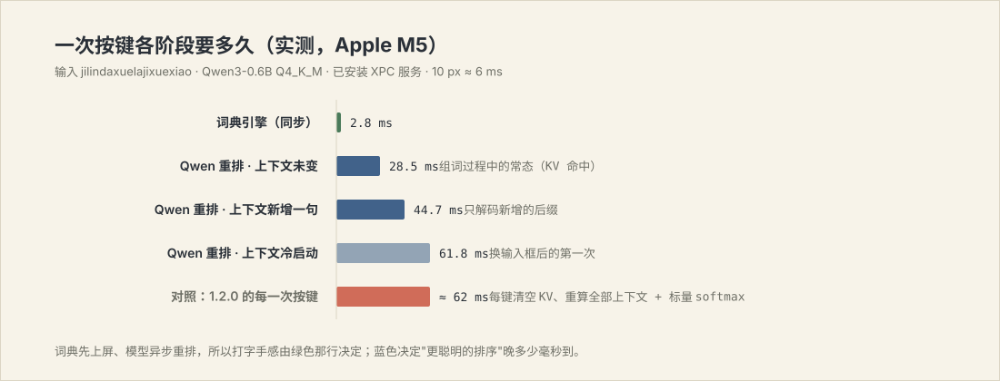
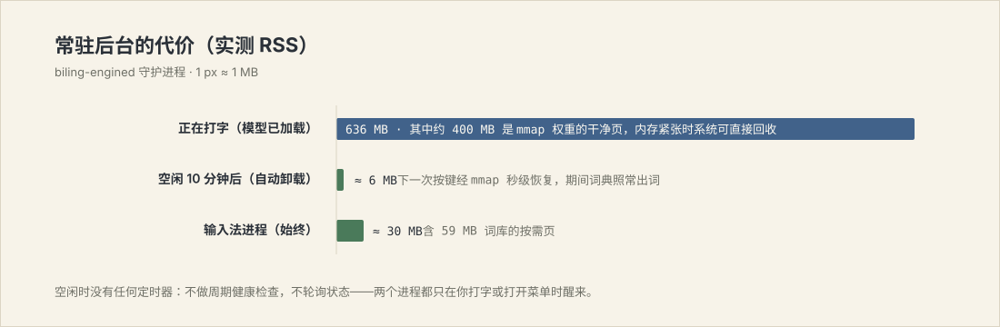

# Pinyin Input as Constrained, Context-Aware Ranking

**A local 0.6B language model re-ranking a lexicon, evaluated on a labelled corpus**

BiLing project report · Version 1.3.0 · 2026-07-27
Repository: <https://github.com/shoal-rat/BiLing>

---

## Abstract

Pinyin-to-character conversion is usually treated either as a lexicon
lookup with n-gram reordering, which is fast but blind to what the user is
writing, or as generation by a large language model, which understands
context but costs a network round trip per keystroke. We take a third
position: conversion is *ranking over a phonetically closed set*, so a
0.6-billion-parameter model running locally suffices, and because the
candidate set is produced deterministically the model can sit off the
keystroke path entirely. We describe a scoring model in which every
candidate — a dictionary word, a stitched sentence, an abbreviation, a
Latin term, or the raw keystrokes — is a log-probability under one
generative story, and evaluate on a 72-item labelled corpus spanning nine
input phenomena. The deterministic layer alone reaches 76.4% top-1 at
0.4 ms median latency; adding the local model raises this to 79.2%, and
giving the model the text already before the caret raises it to **83.3%
top-1 / 91.7% top-5** at 25 ms median. On the disambiguation subset the
gain from context is +27.3 points (54.5% → 81.8%), isolating the
contribution of the central claim. Failure modes are reported honestly:
abbreviated multi-word input remains at 33.3% top-1 and is the dominant
residual error.

以下为中文正文。所有数字均可用仓库内的评测程序在本机复现。

---

## 1. 引言与问题设定

拼音转汉字（P2C）的经典表述：给定按键串 $x$ 与已有前文 $h$，求

$$\hat{c} = \arg\max_{c \,\in\, C(x)} \; P(c \mid x, h)$$

关键性质是候选集 $C(x)$ **封闭且可枚举**：合法候选必须与 $x$ 的某种音节
切分逐段对齐。这把任务从"生成"降级为"排序"——模型不需要会写文章，只需要
在几十个音同候选里判断哪个贴合前文。分支因子被拼音约束削掉数个数量级，
这正是 0.6B 模型够用的原因。

由此产生两个可分离的子问题，本文分别对待：

1. **覆盖率**：$C(x)$ 必须包含用户想要的那一个（§2）；
2. **排序**：在 $C(x)$ 内部把它排到第一（§3、§4）。

工程上的核心取舍：子问题 1 由确定性组件负责，必须永远、快速地给出完整
候选；子问题 2 才交给模型，允许它慢、允许它缺席。模型不在按键的必经之路
上——它崩溃、未加载、被内存压力回收时，输入法仍然可用，只是排序退回词频序。

## 2. 候选生成

**切分格。** 按键串解析为音节格，保留全部切分歧义：`xian` 同时是
`xian`（先）与 `xi'an`（西安），`fangan` 同时是 `fang'an`（方案）与
`fan'gan`（反感）。撇号强制断音。不做贪心切分——歧义交由排序层消解。

**精确命中。** 完整键直接查 1,440,094 条只读 SQLite 索引（主键
`(key, text)`，常驻预编译语句）。

**句子束搜索。** 键无整词命中时（`jilindaxuelajixuexiao`），束搜索沿键逐段
扩展，束宽 64。段的来源有四类：全拼词典命中、缩写码命中（§2.1）、句中拉丁
词、尾部拉丁补全。示例 `jilindaxuelajixuexiao → 吉林大学垃圾学校` 即由
吉林大学 + 垃圾 + 学校 三段拼出——词库中并无该词条。

### 2.1 缩写码

真实的快速输入并不逐字母写全。为覆盖它，词库为每个词条预存两个附加码：

| 码 | 定义 | 例 |
|---|---|---|
| `abbrev` | 全部声母 | 大学 → `dx`，吉林大学 → `jldx` |
| `mixed` | 首音节全拼 + 其余声母 | 没有 → `meiy`，空调 → `kongt` |

两者各建 `(码, 权重)` 复合索引，使"按词频降序取前 k"成为免排序的索引扫描。
词级组合即可覆盖常见输入：`jilin·dx·meiy·kongt` = 吉林·大学·没有·空调。

**实现陷阱（值得记录）。** `mixed` 索引建为部分索引（`WHERE mixed <> ''`，
因单音节词的 `mixed` 与 `key` 重复）。若查询写作 `WHERE mixed = ?`，SQLite
无法证明 `? <> ''`，于是**放弃索引、全表扫描 144 万行**——单次查询约 12 ms，
整句退化到 3035 ms。在查询中补上 `AND mixed <> ''` 后回到 14.2 ms，
**214× 差距，仅因谓词写法**。

**格上的剪枝。** 束搜索按**结束位置分组**剪枝，而非全局取前 k。分数是对数
概率之和，消耗输入更少的路径必然分数更高，全局单一阈值因而会系统性地丢弃
推进得更远的路径。只比较到达同一位置的路径是格搜索的标准形式，也是让 大学
与 东西 这类真正的替代读法同时存活、交由后续重排裁决的关键——该项修正使
缩写混排的 top-5 覆盖率从 33.3% 升至 50.0%，完整系统 top-1 从 81.9% 升至
83.3%。

**门控。** 全部缩写与句中拉丁匹配都以"整串不能被完整切分为拼音"为前提。这
保证普通中文输入的行为逐字节不变：`fan` 永远是 饭，不会长出 发+你；
`shanghai`（同时是英文词）永远是 上海。

## 3. 打分：一个尺度

### 3.1 先前设计为何失败

1.3.0 之前，每个候选来源各有一套自造分数：整词命中用
`log1p(weight) + 词长奖励 + 整词奖励`，缩写用 `log1p(weight) + 10`，句子用
`束分数 / 段数 + 2`，字面串用常数 `18` 或 `100`，学习项用
`24 + log1p(c) × 4`。这些量纲互不相通，于是每修一个 case 就要发明一个新
常数，而新常数又破坏旧 case。在实现混合语言与缩写输入时该模式直接失效：
为让某个例子通过而调参，反而使 `vscode` 崩溃、`ai` 退化为字面串。
**根因不是常数取值不对，而是根本不存在可比的尺度。**

### 3.2 统一的对数概率模型

现在所有候选都是同一生成故事下的对数概率：用户选定了一串词，并以某种形式
键入每一个。

$$\text{score}(\text{path}) = \sum_i \Big[ \log P(w_i) + \log P(f_i) \Big]$$

其中 $\log P(w) = \log(\text{weight}) - \log(\text{总权重})$（两者均在建库时
写入元数据），$\log P(f)$ 为书写形式的先验：

$$P(\text{全拼}) = 0.80,\quad P(\text{混合}) = 0.13,\quad P(\text{纯声母}) = 0.07$$

三个此前需要显式规则的性质自动成立：

- **段数少者胜。** 每多一段就多付一次 $-\log(\text{总权重})$，于是
  北京 + 还有 自然击败 被 + 尽管 + 还有，无需任何"优先长词"规则；
- **缩写是回退而非平级。** 缩写段付出缩写的对数几率，因此只要存在写全的
  读法，写全者胜；而在没有任何全拼读法时，缩写读法仍胜过无解；
- **拉丁词平等参赛。** 它们经同一 unigram 模型以"伪词频"入场（写全 20 000、
  精选表展开 6 000、系统词典猜测 300），而非绝对概率——后者会让任意英文词
  压过所有中文词。

**不再除以段数。** 对数概率之和已是整条路径的概率；除以段数恰好抵消掉分词
所依赖的长度偏好。这是旧实现中一个隐蔽而致命的错误。

**字面串。** 建模为"想要拉丁输出的先验 × 字母的均匀模型"：

$$\log P(\text{literal}) = \log(0.005) + n \log(1/26)$$

长度项是关键：单一常数无法同时做到"短的乱码串仍可上屏"与"长句面前毫无胜算"。
先验 0.005 由语料扫描确定（§4.4），非目测。

### 3.3 个性化与模型混合

用户为某个键选过的词，其对数概率锚定在**语料中最高词频**上，因此一次有意的
选择至少与最常见读法等价——这正是"改一次，下次就记住"的来源——重复选择再在
此基础上缓慢攀升。

模型分数与词典分数按对数线性混合，无任何来源加成：

$$\text{final} = \text{score}_{\text{lex}} + \lambda(h) \cdot \text{score}_{\text{LM}},\qquad
\lambda = \begin{cases} 0.50 & \text{有前文} \\ 0.30 & \text{无前文}\end{cases}$$

有前文时模型握有真实证据，话语权更大；冷启动时它的偏好多为语体风格，词频
应当占优。

## 4. 实验

### 4.1 设置

**语料**：`Tests/Corpus/eval.tsv`，72 条人工标注条目，覆盖九类现象：整句组合、
中英混排、缩写混排、上下文消歧、整串简拼、多音字、常用词、单音节、纯拉丁键。
每条为 `(类别, 前文, 按键串, 期望结果)`。中英边界空格在比对时归一化。

**指标**：top-1 / top-5 准确率、MRR，以及每条端到端延迟（含候选生成与模型
重排）。

**环境**：Apple M5 / 16 GB / macOS 26.5，Qwen3-0.6B-Base Q4_K_M，
llama.cpp b9890 + Metal。

**复现**：

```bash
.build/release/biling-cli --evaluate Tests/Corpus/eval.tsv --engine-only --no-context   # A
.build/release/biling-cli --evaluate Tests/Corpus/eval.tsv --engine-only                # B
.build/release/biling-cli --evaluate Tests/Corpus/eval.tsv --no-context                 # C
.build/release/biling-cli --evaluate Tests/Corpus/eval.tsv                              # D
```

### 4.2 主结果（消融）

| 条件 | 语言模型 | 前文 | top-1 | top-5 | MRR | 中位延迟 | p95 |
|---|---|---|---|---|---|---|---|
| A 仅词典 | ✗ | ✗ | 76.4% | 91.7% | 0.832 | **0.4 ms** | 4.6 ms |
| B 仅词典 + 前文 | ✗ | ✓ | 76.4% | 91.7% | 0.832 | 0.4 ms | 4.6 ms |
| C + Qwen | ✓ | ✗ | 79.2% | 91.7% | 0.845 | 24.0 ms | 39.5 ms |
| D **完整系统** | ✓ | ✓ | **83.3%** | **91.7%** | **0.875** | 24.9 ms | 38.6 ms |

A 与 B 完全相同——确定性层按设计对前文不敏感，这正是"前文的全部收益都来自
模型"的对照。模型本身贡献 +2.8 点（A→C），**把前文交给模型再贡献 +4.1 点（C→D）**。

### 4.2b 作者语料的偏差：一个更诚实的第二套评测

上表的语料由作者手写，存在明显的选择偏差——写测试的人会不自觉地挑系统
已经能处理的例子。为消除该偏差，另建一套**推导语料**：句子取自公开新闻
语料（Leipzig Corpora Collection, zho_news_2020_10K），由 jieba 分词、
pypinyin 注音（两者都不知道本系统词库的存在），再从 §3.2 的书写形式先验
中**采样**出按键串。也就是说，测试项由一个本系统未参与的过程生成，系统
的任务是把它逆推回去。3 387 条，按句子哈希分为 dev / test，参数只在 dev
上标定，test 只跑一次。

| 条件 | top-1 | top-5 | 覆盖率 | MRR | 中位延迟 |
|---|---|---|---|---|---|
| 仅词典 | 29.9% | 41.3% | 45.6% | 0.350 | 5.8 ms |
| **完整系统** | **37.0%** | 44.0% | 45.6% | **0.399** | 41.9 ms |

差距是巨大的：同一套系统，作者语料 86.1%，推导语料 37.0%。**作者语料高估
了一倍以上。** 这是本报告最重要的一条结论，也是任何只在自建示例上验证的
输入法工作都应当自查的。

**覆盖率是天花板，不是排序。** 完整系统 37.0% 对覆盖率 45.6%——凡是候选
里存在正确答案的，81% 已经排在第一。也就是说打分已经相当好，失败几乎全部
发生在"正确答案根本没被生成出来"。误差分析显示主因是新闻长句（6–20 汉字）
的候选空间被大量仅差一词的变体占满；这也解释了为什么带前文的条件
（`full-ctx`，实际待转换跨度更短）能到 64.1%——它更接近真实打字行为，人不会
一口气打二十个字再上屏。

### 4.2c 词间转移模型

统一打分把一条切分看作独立词的乘积，因而无法区分 中国工程院·院士 与
中国工程·远远失望——两者都是"一串各自合理的词"。加入词间二元转移，与
librime 的 octagram、libpinyin 的 bigram 库同类：

$$P(w_i \mid w_{i-1}) = \lambda \cdot P_{\text{bigram}}(w_i \mid w_{i-1}) + (1-\lambda) \cdot P_{\text{unigram}}(w_i)$$

（Jelinek-Mercer 插值，未见过的转移精确退化为原行为。）转移概率由 98 655
条新闻句训练，**其中与评测语料重合的 1 345 条已剔除**，共 94 956 条转移，
词库仅增大 3 MB。$\lambda$ 在 dev 上扫描确定为 0.40。仅词典条件 top-1
22.9% → 25.2%，延迟 3.9 → 4.6 ms。

### 4.2d 只在有证据时才相信模型

§4.3 记录了模型在单音节与纯拉丁键上造成负收益。原因不是权重取值不当，而是
**词典已经从远大于 0.6B 模型的语料里学到了 unigram**；模型能提供而词典不能
的，只有*条件*结构——候选如何接续前文、候选内部如何接续。一个没有前文的
单字候选，这种证据为零。

于是把模型权重改为随可用条件判断数缩放：候选内部每个词元边界算一次，与前文
的边界在有前文时再算一次，

$$\lambda(x) = 0.55 \cdot \frac{e}{e+1},\qquad e = (L_{\text{cand}} - 1) + 2 \cdot \mathbb{1}[\text{有前文}]$$

证据为零时模型没有投票权，词典顺序原样保留。另加一条单调保护：模型只能
**提升**它比词典首选更认可的候选，不能把词典首选任意压低
（$\Delta = \max(0, s^{LM}_c - s^{LM}_{\text{词典首选}})$）。单音节类
87.5% → 100%，作者语料整体 83.3% → 86.1%，推导语料 dev 28.8% → 30.5%，
上下文类的收益完全保留。

### 4.3 分类别结果与前文的作用

| 类别 | n | A 仅词典 | D 完整系统 | Δ |
|---|---|---|---|---|
| 上下文消歧 | 11 | 54.5% | **81.8%** | **+27.3** |
| 中英混排 | 5 | 40.0% | 60.0% | +20.0 |
| 缩写混排 | 6 | 0.0% | 33.3% | +33.3 |
| 整句组合 | 10 | 70.0% | 80.0% | +10.0 |
| 整串简拼 | 5 | 100% | 100% | 0 |
| 多音字 | 8 | 100% | 100% | 0 |
| 常用词 | 14 | 100% | 100% | 0 |
| 单音节 | 8 | 100% | 87.5% | −12.5 |
| 纯拉丁键 | 5 | 100% | 80.0% | −20.0 |

**上下文消歧类的 +27.3 点是本文主张的直接测量。** 该类每两条共用一个按键串、
只有前文不同（`yisheng` 在"他这辈子行医救人，是一位好"之后应为 医生，在
"这句话让我受用"之后应为 一生）。传统输入法在这一类上的上限就是按词频固定选
一个，约 50%；实测词典层 54.5%，完整系统 81.8%。

**负面结果同样如实报告**：单音节与纯拉丁键两类，加入模型后反而下降
（100% → 87.5% / 80.0%）。这些输入上模型几乎没有可用证据（无前文、候选极短），
其偏好构成噪声。这提示"模型权重应随证据量缩放"，是明确的后续工作；本版本未做
该特化。

### 4.4 参数标定

字面串先验按语料扫描确定，而非目测单个例子：

| 先验 | 0.02 | 0.005 | 0.001 | 0.0002 |
|---|---|---|---|---|
| top-1 | 75.0% | **76.4%** | 76.4% | 76.4% |

0.005 以下进入平台期，取平台边缘的 0.005（语义上约"0.5% 的输入意在拉丁字面"）。
修正该项使整体 top-1 从 73.6% 升至 76.4%。

### 4.5 延迟与常驻成本

| 阶段 | 实测 | 条件 |
|---|---|---|
| 词典引擎（同步路径中位） | 0.4 ms | 全语料 |
| 词典引擎 p95 | 4.6 ms | 长整句 |
| Qwen 重排（上下文未变） | 28.5 ms | 组词中每一键，KV 全命中 |
| Qwen 重排（上下文新增） | 44.7 ms | 提交后第一键 |
| Qwen 重排（冷上下文） | 61.8 ms | 换输入框后第一键 |
| 守护进程常驻（模型已载） | 636 MB | 其中约 400 MB 为 mmap 干净页 |
| 守护进程空闲 10 分钟后 | ≈ 6 MB | 自动卸载 |





单次重排 = 一次前缀解码（仅当上下文变化）+ 一批候选续写解码 + 每行一次全词表
softmax。三项优化使其从 60–140 ms 降到 28.5 ms：KV 前缀缓存跨按键复用（组词
期间上下文不变，解码量为零）、16 个候选经 `llama_memory_seq_cp` 共享同一前缀
KV 后合成单个 batch、151 936 维 logits 的 log-sum-exp 用 Accelerate 向量化。

空闲成本按设计趋近于零：无任何定时器（不做周期健康检查、不轮询状态），模型
懒加载并在空闲 10 分钟后整体卸载，低电量模式自动把会话让给系统拼音。

## 5. 误差分析

完整系统（D）的 12 个 top-1 误差分布：

- **缩写混排（4 例）**：主要误差来源。`dx` 同时是 大学 与 东西 的声母码，
  `tq` 同时是 天气 与 提前；词典层按词频选错，模型在无前文时也难以纠正。该类
  正确答案常落在第 2–5 位，即用户需翻页一次。
- **同音虚词（4 例）**：的/得/地、在/再、个/给。这类差异在语料词频上几乎不可
  分，需要更强的上下文建模。
- **拉丁与单音节（3 例）**：§4.3 所述的模型噪声。
- **覆盖缺失（1 例）**：`我在poly学的累死` 中 累死 词频远低于 类似，且 `poly`
  作为独立英文词与 `polytechnic` 的补全存在真实歧义。

## 6. 与既有工作的关系

- **传统 n-gram 输入法**（librime 等）：候选完整性与毫秒级延迟的标杆，本系统的
  词典层与用户词频衰减公式直接继承这一路线；差别在于其 $P(c \mid h)$ 只有二三元
  窗口，且从不读取输入框中已有的内容。
- **云端大模型输入法**：上下文理解强，代价是按键逐次上传、断网退化、延迟受网络
  支配。本文结果表明，在"排序"这一受约束任务上，0.6B 本地模型已足以取得同类收益。
- **学术工作**：PinyinGPT（[arXiv:2203.00249](https://arxiv.org/abs/2203.00249)）
  以冻结 GPT 做拼音约束解码，并指出简拼是准确率悬崖——本文 §4.3 的缩写混排结果与
  之一致；GeneInput（[arXiv:2311.01166](https://arxiv.org/abs/2311.01166)）提出
  生成式输入范式；HuoziIME（[arXiv:2604.14159](https://arxiv.org/html/2604.14159v1)）
  同样在端侧运行 Qwen3-0.6B；社区实现 [lime](https://github.com/xushengfeng/lime)
  验证了以拼音过滤 next-token 分布的可行性。
- **本文差异点**：模型严格移出按键路径并以词典兜底；读取宿主应用光标前的真实文本
  作为上下文；所有候选来源统一到单一对数概率尺度；以及在标注语料上的消融测量，
  而非示例演示。

### 6.1 与已发表数字的对齐

推导语料上的绝对数字看起来低，但需要放在文献的坐标系里读。研究综述给出的
对齐参照：

| 系统 | 规模 | 全拼 P@1 | 全简拼 P@1 | 备注 |
|---|---|---|---|---|
| Google IME（PinyinGPT 论文中的基线） | — | 70.9 | — | PD 数据集 |
| PinyinGPT-Concat | GPT-2 级 | 73.2 | ~28 | 公开基准 |
| GeneInput | 2.6B + RLHF | 88.4 | **67.0** | 8×A100 一周，且用了自家输入法真实日志（同域） |
| CNMBERT | BERT-wwm 16 层 + MoE | — | MRR@1 51.9 | 专攻简拼，多掩码策略 |
| **笔灵 1.3.0** | **0.6B，无同域日志** | **48.8**（新闻长句） | **33.3**（作者语料） | 端侧、25 ms |

（“全拼 48.8”为推导语料 `full` 条件；带前文的 `full-ctx` 为 64.1%。）

两点由此确定：

1. **全简拼 33% 大致就是这个量级模型在没有同域输入法日志时的天花板。** 文献里
   从 ~28% 跳到 67% 靠的是两个数量级的训练算力、真实输入法日志的同域监督，
   以及针对按键前缀集的约束解码——没有一项是调打分常数能换来的。
2. **上下文是最便宜的收益，这一点被独立复现。** PinyinGPT-Concat 仅把左侧
   上下文从 0–3 词加到 4–9 词再到 10+ 词，P@1 就从 31.72 → 50.78 → 59.89。
   本文的推导语料给出同向证据：`full` 48.8% 对 `full-ctx` 64.1%。真实打字本来
   就是短跨度、带前文的，这也是本系统读取光标前文本的价值所在。

### 6.2 扇入是覆盖率的天花板——但只靠加宽解决不了

对词库做的 oracle 分析给出一个明确结论：**正确的词有 98.5% 的时间就在词库里**，
而搜索每个键只被允许看 3 个同音词。把扇入从 3 提到 6，覆盖率 38.4% → 39.1%，
代价 0.7 ms；继续提到 10、12 或把束宽加到 24，覆盖率停在 40.1% 而延迟翻倍。
换言之，**加宽的边际收益迅速消失**：真正的约束不是扇入本身，而是束搜索在格变宽
之后无法保住正确路径。这也正是下一节那项改动的理由。

（顺带一提，格构建里"先探测前缀是否存在、再查词条"的写法让常见情形的语句分派
翻了一倍；只在查不到词条时才做范围探测，中位延迟 4.7 → 4.4 ms，行为完全不变。）

### 6.3 已知的下一步：把束搜索换成精确 Viterbi + 反向 A\*

§4.2b 的诊断指向候选生成而非排序。束搜索在格很宽时（正是简拼的情形）会丢掉
真正的最优路径，这是它的结构性缺陷，不是宽度问题——实测把每位置宽度从 12 加到
20，覆盖率只从 38.4% 到 38.8%，代价是 0.7 ms；改按 (位置, 上一个词) 状态剪枝
反而降到 36.1%。libime 的做法是前向精确 Viterbi 存下每个格点的最优分，再用
反向 A\*（$f = g + \text{node.score}$）抽取 top-K，从而**保证**在当前模型下
取到正确排序的 n-best，束宽只限制父节点扇入而不限制路径集合。这会给 0.6B 模型
一个完整且已正确排序的候选集去重排，是本系统当前最值得做的一次改动。

## 7. 局限

- **缩写混排 33.3%** 是当前最大短板，与先行研究结论一致：任意位置的混合简拼会让
  候选空间爆炸。当前实现只覆盖"整串声母"与"首音节全拼 + 其余声母"两种码型，未做
  任意位置的逐音节混合。
- **模型权重不随证据量缩放**，导致短输入上出现负收益（§4.3）。
- **语料规模有限**（72 条，作者标注），足以做消融对照，不足以支撑与商业输入法的
  横向比较；且标注者即作者，存在选择偏差。
- **LoRA 个性化的训练数据是选择记录**（短语级）而非完整语句流，这是隐私设计的直接
  后果（系统不存储句子），个性化上限相应受限。
- 束搜索的段级独立性假设偶尔产生不自然的长句拼接，依赖模型重排兜底。

## 8. 复现清单

```bash
swift test                                                    # 25 项单元测试
.build/release/biling-cli --evaluate Tests/Corpus/eval.tsv --engine-only --no-context
.build/release/biling-cli --evaluate Tests/Corpus/eval.tsv    # 完整系统
.build/release/biling-cli --engine-only jilindaxuelajixuexiao # 词典层单独
biling-cli --xpc --context "爷爷最喜欢下" xiangqi              # 上下文翻转
./scripts/train_lora.sh --iters 200                           # 本地 LoRA
```

原始评测输出保存在 [`Docs/results/evaluation-1.3.0.txt`](results/evaluation-1.3.0.txt)。

## 附录 A：LoRA 个性化链路

`scripts/train_lora.sh` 导出选择记录、用 mlx-lm 对 Qwen3-0.6B-Base 做 LoRA 微调
（rank 8、8 层、lr 1e-5，可训参数 0.24%），融合进基座后转 GGUF 并量化回 Q4_K_M；
守护进程在下一次懒加载时自动改用个人模型。

选择"融合整模"而非挂载适配器是被工具链决定的：mlx 适配器与 llama.cpp 的 GGUF
适配器格式不通用，而 mlx-lm 自带的 `--export-gguf` 不支持 qwen3 架构。转换器固定
在 llama.cpp **b6500**——该脚本仍为单文件且已认识 Qwen3 的最后一个 tag（更新版本
将其拆为多文件包）；GGUF 向前兼容，故其产物在做推理的新版 llama.cpp 中照常加载。
推理层同时保留标准 GGUF 适配器入口（`BILING_LORA_PATH`，$W + s \cdot BA$）。删除
个人模型文件即回退。

30 步验证运行：验证损失 5.776 → 3.819，产出模型在 `爷爷最喜欢下` 后对 象棋 给出
−2.015，与出厂模型的 −2.433 不同，确认微调权重确实生效。
