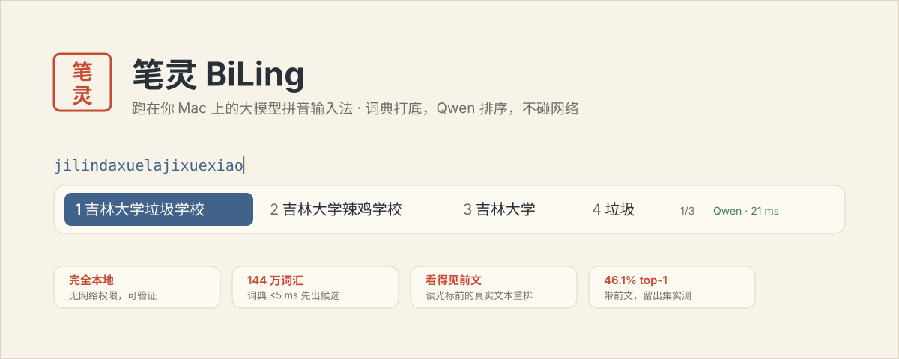
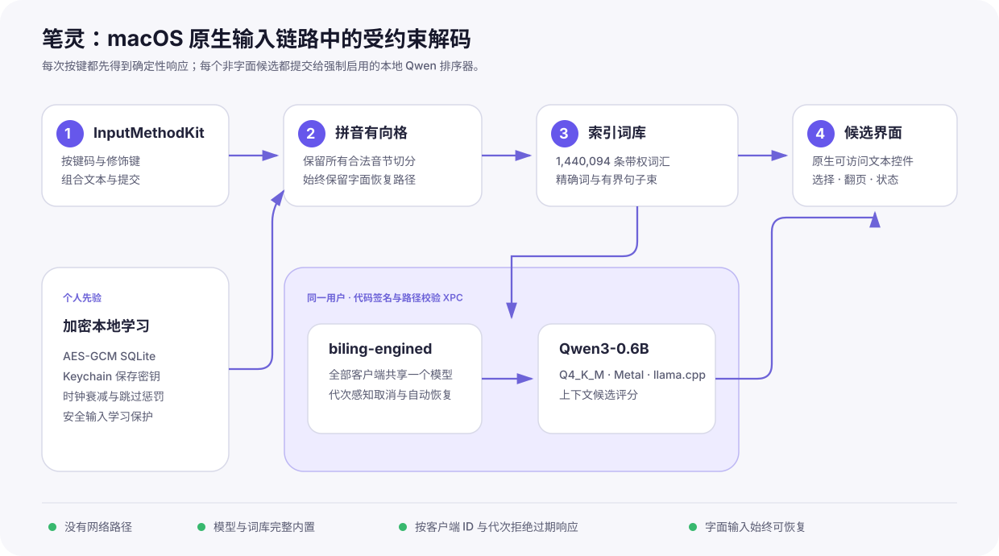

# 笔灵 BiLing

**简体中文** · [English](README_EN.md)



## 让文字先抵达，让工具退到身后。

笔灵是一款原生 macOS 拼音输入法。它把 144 万条开源词汇、完整拼音格与
Qwen3 本地模型放进同一条低延迟输入链路：词典负责提出可靠候选，模型结合
上下文重新排序，个人偏好只在这台 Mac 上学习。

输入 `jilindaxue`，第一候选就是 **吉林大学**。按下空格，继续思考。

> **本地，完整，开箱即用。** 模型、词库、推理运行时和学习数据均留在本机。
> 笔灵不需要账号、API Key、联网推理或从零培养词库，也不存在“仅词典模式”。
> 在线安装器会自动取得仓库内固定版本的模型并校验，无需用户寻找模型。

### 三分钟开始输入

推荐普通用户从
[最新 Release](https://github.com/shoal-rat/BiLing/releases/latest)
下载 `BiLing-1.2.0-online-installer-macOS-arm64.zip`，解压后右键打开
“在线安装笔灵.command”。安装包已经包含 App、Metal 后端和完整词库；脚本会
从仓库的固定 Git LFS 提交下载唯一的 Qwen 文件并验证摘要，不需要 Homebrew、
Xcode 或 API Key。

开发者也可以从源码安装：

```bash
git clone https://github.com/shoal-rat/BiLing.git
cd BiLing
brew install llama.cpp ggml libomp
./scripts/install.sh
```

安装完成后，从 macOS 菜单栏输入法菜单选择 **笔灵**，输入拼音并按空格提交。
笔灵和 Qwen 会随登录自动启动；即使模型进程意外退出，launchd 与输入法客户端
也会共同完成自动拉起、健康检查和重连。

---

# 面向 macOS 的原生本地大模型拼音输入法

## 摘要

笔灵将拼音转换建模为一个受约束的上下文排序问题。确定性引擎首先把增量拼音
解析为有向无环格，从索引词库中构造词级与句级候选；随后，
Qwen3-0.6B-Base 使用近期已提交文本对优先候选重新评分；最后，本地用户先验
根据安全选择即时更新排序。

实现上，延迟敏感的 InputMethodKit 进程与模型推理进程严格分离。输入控制器
负责组合文本、候选窗和提交生命周期；一个由 launchd 管理的守护进程独占
373 MB 量化模型，并通过仅限同一用户、经过代码签名和路径校验的 XPC 接口
提供带代次标记的排序服务。项目不提供“仅词典”降级运行方式：所有非字面候选
都必须经过 Qwen，Return 始终保留原始字面输入作为可恢复出口。

发布版内置 1,440,094 条唯一词汇，编译为 59 MB 只读 SQLite 索引。用户第一次
按键即可获得实用词汇，无需导入词典，也无需在输入法进程中实例化数百万个
Swift 对象。

## 1. 系统模型



上图与页首横幅均为原生 SVG。SVG 使用矢量路径、文字、渐变和滤镜描述界面，
与像素位图不同，它在 GitHub、Retina 屏幕和论文 PDF 中任意缩放都不会失真，
同时仍可被搜索、审查和版本控制。真实候选窗则由 AppKit 原生文本控件构成，
不是把文字预先烘焙进图片。

运行时包含两个长期进程：

1. **`BiLing.app`** 通过 InputMethodKit 接收按键，维护 marked text，查询词汇
   索引，显示候选并提交选择。
2. **`biling-engined`** 持有唯一的 Qwen 模型实例，通过 XPC 返回上下文分数。
   新代次会取消旧请求；客户端 ID 或代次过期的响应会被丢弃。

这个边界避免每个输入会话重复加载模型，也让模型初始化完全离开同步按键回调。
两个进程都由用户域 LaunchAgent 在登录时启动：模型服务声明 Mach service，
输入法进程声明稳定的 IMK 连接。客户端每 15 秒做一次健康检查，并在连接中断
时使用 1–15 秒指数退避重建 XPC 连接。

## 2. 候选生成理论

设 \(x\) 为原始拼音缓冲区，\(h\) 为近期已提交上下文，\(u\) 为本地用户先验。
确定性阶段构造候选集合：

\[
C(x) = C_{\mathrm{exact}}(x) \cup C_{\mathrm{beam}}(x)
       \cup C_{\mathrm{English}}(x) \cup \{x\}.
\]

`PinyinLattice` 保留全部合法音节边界，不进行不可逆的贪心切分。骨干引擎再合并：

- 索引词库中的精确多音节词；
- 由当前位置所有可达前缀形成的有界句子束；
- 输入并非纯拼音时的中英混合延续；
- 加密学习库中的个人词条；
- 始终可由 Return 提交的原始字面串。

对候选 \(c\)，笔灵采用如下形式的混合分数：

\[
S(c \mid x,h,u) =
B_{\mathrm{lex}}(c,x)
+ \lambda L_{\mathrm{Qwen}}(c \mid h)
+ \mu U(c \mid u)
+ \beta_{\mathrm{exact}}.
\]

\(B_{\mathrm{lex}}\) 结合词频、词长与拼音格覆盖率；
\(L_{\mathrm{Qwen}}\) 是本地语言模型分数；\(U\) 是带时钟衰减的选择先验，并对
反复展示而未选择的候选施加柔性惩罚。精确短语项防止可靠词语被逐字切分淹没。
发布门槛明确要求在没有任何个人学习的条件下，
`jilindaxue → 吉林大学` 排名第一。

Qwen 对首屏候选执行共享前缀批量评分。它是**排序器**，不是自由生成器：
拼音格与词汇阶段定义合法输出，模型只判断哪个候选最适合当前上下文。

## 3. 词库

笔灵内置的编译词库来自：

- 万象拼音维护的 `dicts/jichu.dict.yaml` 主词库；
- Apache-2.0 许可的 Rime `pinyin-simp`；
- 运行时构造的字面与中英混合候选。

万象拼音固定在提交
`1daf1e973001271331517fef3fb86eceb7e69afd`。构建过程把带声调读音统一为
ASCII 拼音（例如 `lǜ sè → lv se`），合并重复的 `(pinyin, text)` 对，并保留
来源权重。原始词典、CC BY 4.0 许可证、固定提交和转换说明均位于
`Resources/Lexicon/`，安装时也会复制到 App 的许可证目录。

生成数据库已经作为骨干资源提交，普通用户不需要运行编译器。维护者可复现：

```bash
python3 scripts/build_dictionary.py \
  --source Resources/Lexicon/pinyin_simp.dict.yaml:1.25 \
  --source Resources/Lexicon/wanxiang-jichu.dict.yaml:4.0 \
  --output Sources/BackboneEngine/Resources/lexicon.sqlite3
```

数据库以 `(pinyin, text)` 为主键，使用 SQLite full-mutex 只读打开。精确查询按
拼音键索引，造句过程只查询当前拼音格位置可达的前缀。

## 4. 模型与推理

强制模型为 Q4_K_M 量化的 `Qwen3-0.6B-Base`：

| 属性 | 数值 |
|---|---|
| 参数量 | 596.05 M |
| 文件 | `qwen3-0.6b-base-q4_k_m.gguf` |
| 大小 | 396,704,512 字节 |
| SHA-256 | `218d3f063193b40008d4e63d90cf83e7dc6d33a8c6c1c647589f868a8fc74492` |
| 运行时 | llama.cpp + Metal |
| 许可证 | Apache License 2.0 |

模型通过 Git LFS 与源码一同分发。预构建 Release 的在线安装器从固定提交取得
同一文件；安装器会拒绝缺失、截断或摘要不匹配的模型。推理由独立 LaunchAgent
统一承载，所有输入会话
共享同一份权重；引擎和输入法均设置 `RunAtLoad` 与 `KeepAlive`。

连接中断不再永久显示“Qwen 不可用”。客户端会把状态显示为“正在启动或恢复”，
定期探测服务并指数退避重连；安装器还会从**实际安装后的输入法可执行文件**
发起健康检查，而不只验证诊断 CLI。在 Apple M5 的开发验证中，
`jilindaxue` 暖机排序耗时 137.9 ms，并把 **吉林大学** 排在第一。该数值是一次
实测记录，不代表所有硬件的固定延迟。

## 5. 安装

### 5.1 预构建版（推荐）

要求：Apple silicon Mac，macOS 26 或更新版本。

1. 从 [Releases](https://github.com/shoal-rat/BiLing/releases/latest) 下载
   `BiLing-1.2.0-online-installer-macOS-arm64.zip`。
2. 解压，右键“在线安装笔灵.command”，选择“打开”。
3. 等待脚本下载固定版本的 Qwen，并依次显示摘要校验、排序检查和输入源注册
   成功。
4. 从菜单栏输入法菜单选择 **笔灵**。

当前发布由项目进行 ad-hoc 代码签名，因为构建账户没有 Apple Developer ID
证书，因此未经过 Apple 公证。macOS 若显示开发者验证提示，请在
“系统设置 → 隐私与安全性”中核对应用名和下载来源后选择“仍要打开”。项目不会
要求关闭 Gatekeeper；希望完全自行验证的用户应采用源码安装。

### 5.2 源码安装

要求：

- macOS 26、Apple silicon；
- Xcode 26 命令行工具与 Swift 6.3 或更新版本；
- Homebrew 构建依赖 `llama.cpp`、`ggml`、`libomp`；
- Git LFS。

```bash
git lfs install
git clone https://github.com/shoal-rat/BiLing.git
cd BiLing
brew install llama.cpp ggml libomp
./scripts/install.sh
```

安装器会：

1. 校验模型大小与 SHA-256；
2. 以 release 模式构建 App、模型守护进程和诊断 CLI；
3. 组装并 ad-hoc 签名自包含的 `BiLing.app`；
4. 执行 IMKServer、事件路由、144 万词库、候选窗和 Qwen/XPC 发布门槛；
5. 把旧版保存在 `~/Library/Application Support/BiLing/Backups`；
6. 安装到 `~/Library/Input Methods/BiLing.app`；
7. 安装并启动输入法与 Qwen 两个登录启动项；
8. 验证真实输入法进程可以访问模型；
9. 将笔灵注册为**非拉丁简体中文输入源**，并恢复安装前的输入源。

首次安装后输入源菜单若尚未刷新，请注销并重新登录一次，这是 macOS 的输入源
缓存行为。

## 6. 第一次使用

1. 在菜单栏输入法菜单选择 **笔灵**。
2. 聚焦普通文本框。
3. 输入 `jilindaxue`。
4. 确认候选窗显示 **1 吉林大学**。
5. 按空格提交。

候选窗有三种模型状态：

- `Qwen · 排序中`：当前代次正在推理；
- `Qwen · N ms`：最近一次排序成功；
- `Qwen · 暂不可用`：当前请求失败，客户端正在自动恢复。

从输入法菜单选择“笔灵设置…”可以打开设置窗口，控制中英边界自动空格、中文
全角标点与即时本地学习。学习页面可以查看和一键清除笔灵保存的偏好。

### 键盘操作

| 输入 | 动作 |
|---|---|
| `a`–`z`、`'` | 扩展拼音组合 |
| 空格 | 提交高亮候选 |
| `1`–`9` | 提交编号候选 |
| 左 / 右 | 移动高亮 |
| 上 / 下 | 切换候选页 |
| Return | 提交原始字面输入 |
| Escape | 取消组合 |
| Command / Control / Option 快捷键 | 先提交字面输入，再传递快捷键 |

### “中/英”键与 Caps Lock

macOS 把中文键盘上的“中/英”键与可配置的 Caps Lock 切换视为同一机制：在
非拉丁输入源与最近使用的拉丁输入源之间切换。笔灵 1.2.0 明确注册为
`smSimpChinese` 且 `TISInputSourceIsASCIICapable = false`，不再被误识别为
英文输入源。因此系统行为为：

- Apple 拼音 → 英文；
- 英文 → 笔灵（笔灵是简体中文主输入模式时）；
- 笔灵 → 英文。

请在“系统设置 → 键盘 → 文本输入 → 编辑”中打开“使用大写锁定键切换至和切换
自最近使用的拉丁输入源”。带“中/英”键的中文键盘使用同一设置。若系统仍保存
旧版元数据，重新运行安装器后注销并登录一次。

## 7. 学习与隐私

选择学习完全在本地完成。每次符合条件的提交都会更新 AES-GCM 加密的 SQLite
存储；密钥由 `SecRandomCopyBytes` 生成并保存在 Keychain；存储目录被排除在
系统备份之外。

以下情形不会学习：Secure Event Input 激活时、终端、密码管理器、钥匙串类
客户端、长数字串、URL、类似邮箱的文本和高熵字面串。字面候选永不进入学习库。
项目没有网络推理路径，也不导出原始按键流。

XPC 守护进程只接受同时满足以下条件的连接：

- 有效用户 ID 与引擎相同；
- 可执行文件来自预期的已安装 App 路径；
- 通过 macOS 代码签名有效性校验。

## 8. 候选窗与输入生命周期

笔灵只使用 InputMethodKit 的完整回调
`inputText(_:key:modifiers:client:)` 处理按键。在当前 macOS 上混用该回调、
`handleEvent` 和简化 key-binding 回调会造成分派歧义。

候选标签是非激活 `NSPanel` 内的 AppKit `NSTextField`，不是在
`NSVisualEffectView.draw(_:)` 中自绘文字。这修复了视觉效果视图提前消费绘制
过程所导致的宽大空白候选条。裁剪视口保证完整显示全角 CJK 标签，同时保留
页码与 Qwen 状态。


提交、取消、停用和销毁时，输入控制器都会使旧代次失效；调用 marked-text API
之前也会校验 `IMKTextInput` 发送者。

## 9. 验证与复现

运行测试：

```bash
swift test
```

当前 19 项测试覆盖拼音格歧义、撇号边界、多音字、中英混合分类、字面恢复、
即时学习、隐私保护、主要按键路由、144 万词条发布下限、带声调拼音归一化和
“吉林大学”第一候选回归。

直接测试模型：

```bash
.build/release/biling-cli \
  --model Models/qwen3-0.6b-base-q4_k_m.gguf \
  jilindaxue
```

测试已安装 XPC 服务：

```bash
"$HOME/Library/Input Methods/BiLing.app/Contents/Helpers/biling-cli" \
  --xpc jilindaxue
```

查看生命周期日志：

```bash
log show --last 10m \
  --predicate 'subsystem == "com.biling.inputmethod.BiLing"' \
  --style compact

tail -n 100 "$HOME/Library/Application Support/BiLing/engine.log"
tail -n 100 "$HOME/Library/Application Support/BiLing/app.log"
```

## 10. 故障排查

### 选择笔灵后没有文字或候选

重新运行安装器。1.2.0 的安装门槛会在覆盖现有版本前验证 InputMethodKit 启动、
事件路由、词库、候选窗和 Qwen。如果系统仍持有旧输入源缓存，请注销并登录。

### 候选窗是一条宽大的空白条

安装 1.1.0 或更新版本。候选行已经改用原生文本控件，并由布局 smoke test 与
可渲染快照命令覆盖。

### 显示“Qwen 正在启动或恢复”

首次登录时模型冷启动通常需要数秒。若超过 30 秒：

```bash
launchctl print "gui/$(id -u)/com.biling.inputmethod.engine"
launchctl print "gui/$(id -u)/com.biling.inputmethod.app"
tail -n 100 "$HOME/Library/Application Support/BiLing/engine.log"
```

1.2.0 会定时健康检查、自动重连，并由 launchd 自动重启两个进程。模型摘要不
匹配时安装器会提前失败，避免把损坏版本注册给系统。

### “中/英”键总是切到笔灵

这表示 macOS 仍使用旧版的 ASCII-capable 元数据。重新运行 1.2.0 安装器并
注销登录。验证命令：

```bash
xcrun swift scripts/register.swift /path/to/BiLing.app
```

脚本会拒绝任何被系统识别为 ASCII-capable 的笔灵输入模式。

## 11. 工程结构

```text
BiLing/
├── Models/                         Qwen GGUF（Git LFS）与许可证
├── Resources/
│   ├── App/Info.plist              InputMethodKit 与中英切换元数据
│   ├── Lexicon/                    带署名的词典源
│   └── LaunchAgents/               输入法与模型登录启动模板
├── Sources/
│   ├── PinyinLattice/              增量拼音切分
│   ├── BackboneEngine/             索引词库与加密学习
│   ├── InputSessionCore/           纯按键路由
│   ├── IPCProtocol/                带代次的 XPC 协议
│   ├── LLMRanker/                  llama.cpp Qwen 排序器
│   ├── BiLingEngine/               经校验的 XPC 服务
│   ├── BiLingApp/                  控制器、候选窗与设置
│   └── BiLingCLI/                  模型诊断工具
├── Tests/
└── scripts/
    ├── build_dictionary.py
    ├── install.sh
    ├── install_online.sh
    ├── install_prebuilt.sh
    ├── package_online_release.sh
    ├── package_release.sh
    ├── register.swift
    └── uninstall.sh
```

## 12. 卸载

```bash
./scripts/uninstall.sh
```

卸载器把 App 与两个 LaunchAgent 移到废纸篓，保留个人学习数据，因此操作仍可
恢复。若要同时清除学习数据，可在卸载前从“笔灵设置 → 学习与隐私”中执行。

## 13. 来源、许可证与引用

- [Qwen3-0.6B-Base](https://huggingface.co/Qwen/Qwen3-0.6B-Base)，Apache-2.0
- [llama.cpp](https://github.com/ggml-org/llama.cpp)
- [万象拼音](https://github.com/amzxyz/rime_wanxiang)，CC BY 4.0
- [Rime pinyin-simp](https://github.com/rime/rime-pinyin-simp)，Apache-2.0
- [Apple InputMethodKit](https://developer.apple.com/documentation/inputmethodkit)
- [Apple：在 Mac 上切换中文输入法](https://support.apple.com/zh-cn/guide/chinese-input-method/cim119a8d473/mac)

精确许可证文本与署名元数据随相关源文件提供，并复制到安装后 App 的
`Contents/Resources/Licenses`。如在研究中使用本项目，请引用对应的 GitHub
Release 与固定提交。
