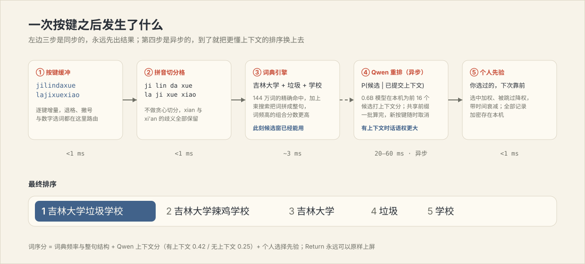
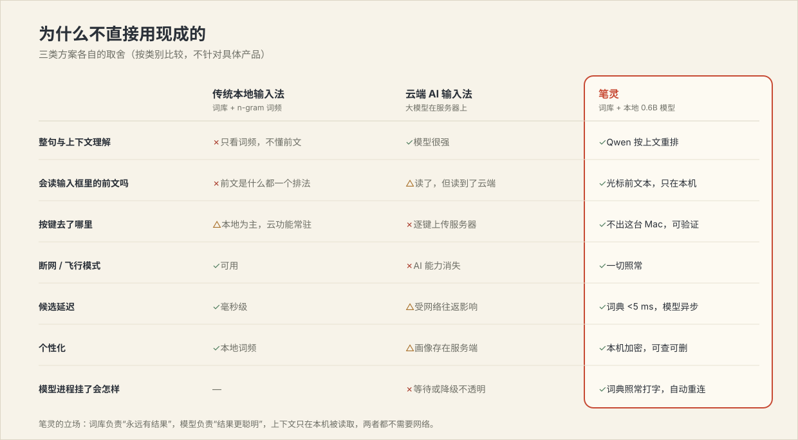
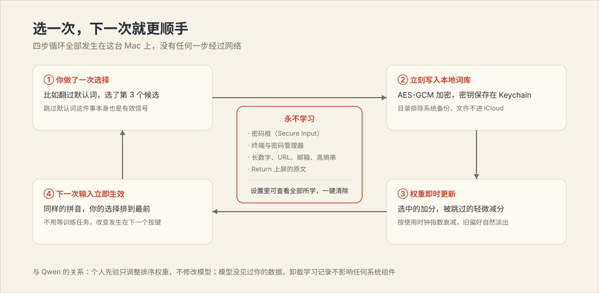

# 笔灵 BiLing

**简体中文** · [English](README_EN.md)


笔灵是一个 macOS 原生拼音输入法。词典引擎负责在几毫秒内给出完整候选，
本机运行的 Qwen3-0.6B 负责按上下文把候选排得更聪明，你的选择在这台 Mac
上加密学习。整个工程没有网络权限——不是"承诺不上传"，是根本没有上传的路。

试试连打一整句：输入 `jilindaxuelajixuexiao`，第一候选就是
**吉林大学垃圾学校**——词典里并没有这个词条，它是引擎现场把
吉林大学、垃圾、学校 三段拼出来、再由模型确认的结果。按空格上屏。

## 安装

### 直接装（推荐）

Apple silicon Mac，macOS 26 或更新。

1. 从 [Releases](https://github.com/shoal-rat/BiLing/releases/latest) 下载
   `BiLing-1.3.0-macOS-arm64.zip` 并解压；
2. 右键 `安装笔灵.command`，选"打开"；
3. 安装器会自己校验模型摘要、启动服务、跑一遍
   `jilindaxuelajixuexiao → 吉林大学垃圾学校` 的排序检查，然后注册输入源；
4. 在菜单栏输入法菜单里选 **笔灵**。

发布包是 ad-hoc 签名（没有 Apple Developer ID，未经公证）。macOS 弹出
开发者验证提示时，去"系统设置 → 隐私与安全性"里确认后选"仍要打开"；
不放心的话直接走源码安装，每一行都在这个仓库里。

### 从源码装

需要 Xcode 26（或对应命令行工具，Swift 6.3+）、Homebrew、Git LFS。

```bash
git lfs install
git clone https://github.com/shoal-rat/BiLing.git
cd BiLing
brew install llama.cpp ggml libomp
./scripts/install.sh
```

脚本会构建三个可执行文件，组装成自包含的 `BiLing.app`（模型、词库、
llama.cpp 动态库全部打进去），装到 `~/Library/Input Methods`，配置两个
登录启动项，最后用真实安装产物跑完整套冒烟检查——任何一步失败都不会
覆盖你现有的安装。旧版本自动备份到 `~/Library/Application Support/BiLing/Backups`。

装完如果输入法菜单里还没有"笔灵"，注销再登录一次——这是 macOS 的输入源
缓存，不是安装失败。

## 它怎么找到好词



关键的取舍在于：**模型不在按键的必经之路上。**

1. 按键先进拼音切分格。切分不做贪心决定，`xian` 同时保留 先 和 西安
   的可能，`'` 可以手动断音；
2. 词典引擎立刻查 144 万词的索引：整词直接命中，命不中的就用束搜索把
   词一段段接成整句（吉林大学垃圾学校 就是这么来的）。这一步在 M5 上
   约 3 毫秒，候选窗此刻已经可用；
3. Qwen3-0.6B 在独立进程里给前 16 个候选打上下文分。上下文优先取
   **输入框里光标前的真实文本**（每次开始组词时向宿主 App 读一次，最多
   600 字符；Terminal 等不支持的场景退回本次会话已提交的文本）——你在
   邮件里接着别人的话写，模型看到的就是那封邮件。这一步是异步的：分数
   回来就原位重排，新按键一到就取消旧请求，过期结果直接丢弃；
4. 你个人的选择历史最后加权：选过的词往前排，翻页跳过的默认词轻微降权，
   权重随时间衰减。

模型进程崩了、还没启动、或者被系统内存压力收走？词典引擎照常工作，
你最多损失"更懂上下文"的那部分排序，打字本身永远不停。

### 同一串拼音，两种前文

这是传统输入法给不了的：它们不管你正在回复什么，同一串拼音永远同一个
排序。笔灵读的是输入框里光标前的真实文本，所以第一候选跟着你的话走——
下面每一行都是安装版实测输出：

| 你写到一半的话 | 接着输入 | 第一候选 |
|---|---|---|
| 他这辈子行医救人，是一位好 | `yisheng` | **医生** |
| 这句话让我受用 | `yisheng` | **一生** |
| 我突然 | `xiangqi` | **想起** |
| 爷爷最喜欢下 | `xiangqi` | **象棋** |
| 我们在化学课上做 | `shiyan` | **实验** |
| 他违背了当初的 | `shiyan` | **誓言** |

自己复现（`--context` 模拟输入框里已有的文字）：

```bash
"$HOME/Library/Input Methods/BiLing.app/Contents/Helpers/biling-cli" \
  --xpc --context "爷爷最喜欢下" xiangqi
```

真实候选窗（AppKit 原生控件，非拼图）：


## 进程怎么分工


`BiLing.app` 是 InputMethodKit 进程，只做延迟敏感的事：按键路由、切分、
词典查询、候选窗和提交。`biling-engined` 是 launchd 管理的守护进程，
独占一份模型权重，服务所有输入会话；它只接受同一用户、来自已安装
App 路径、代码签名有效的 XPC 连接。请求带代次标记，谁过期谁被丢弃——
异步结果永远不会落到别的窗口里。

## 为什么值得做一个新的



- 传统本地输入法快而可靠，但排序只看词频，也从不看输入框里已有的文字。
  上面那张表里的六行，它们只能给出三种固定答案；
- 云端 AI 输入法懂上下文，代价是每一个按键都发到别人的服务器上，
  断网就退化；
- 笔灵把这两样拼在一起：词典的速度、模型的语感，全在本机。0.6B 的模型
  做"从一小撮拼音匹配的候选里挑一个"绰绰有余——这比自由生成容易得多。

完整的打分公式、束搜索细节、逐阶段延迟与内存实测图表，见
**[原理文档 Docs/THEORY.md](Docs/THEORY.md)**。

## 学习与隐私



- 每次有效选择立刻写进本地库：AES-GCM 加密，密钥在 Keychain，目录排除
  在 Time Machine 与 iCloud 备份之外；
- 学的是"哪个拼音你选了哪个词"的计数，不是按键流水；
- 这些场景永远不学：Secure Input（密码框）激活时、终端和密码管理器里、
  长数字、URL、邮箱、高熵字符串、以及你用 Return 原样上屏的内容；
- "笔灵设置 → 学习与隐私"能看到它学的每一条，也能一键全部清掉。

## 键盘

| 按键 | 动作 |
|---|---|
| `a`–`z`、`'` | 组合拼音 |
| 空格 | 上屏高亮候选 |
| `1`–`9` | 上屏对应编号候选 |
| ← / → | 移动高亮 |
| ↑ / ↓ | 翻页 |
| Return | 原样上屏字母串 |
| Esc | 取消组合 |
| ⌘ / ⌃ / ⌥ 组合键 | 先上屏字面输入，快捷键继续传给应用 |

中文语境下 `,` `.` `?` `!` `:` `;` 自动转全角；中英文相邻自动补空格；
两者都能在设置里关。

夹在句子里的拉丁字母不用切换模式，识别分三层：

- **精选词表**（约 260 条，带正确大小写还原）：AI 与公司名
  （`claude → Claude`、`openai → OpenAI`、`chatgpt → ChatGPT`）、科技与
  金融缩写（`ai → AI`、`gdp → GDP`、`ipo → IPO`）、中文互联网用语
  （`xswl`、`yyds`、`emo`、`ddl`）、常见英文人名（`tom → Tom`、
  `emma → Emma`）；
- **系统词表**：其余英文单词来自 macOS 自带的 20 万词表，首次用到时才
  在后台加载；
- **排序规矩**：字母串同时是合法拼音时中文优先——`ai` 第一位还是 爱，
  AI 排在几名开外；`fan` 是 饭 不是 fan；但 `openai` 这种没有真实词条
  对应的键，OpenAI 直接排第一，不会输给硬拼出来的"哦喷爱"。

大写字母开头直接进入字面模式，`iPhone` 不会被强行转换。"中/英"键遵循
系统语义：笔灵注册为非拉丁简体中文输入源，和 Apple 拼音一样参与
Caps Lock 切换。

## 性能与能耗

输入法是常驻后台的进程，省电和快同样重要：

- **同步路径**：切分 + 词典 + 个人先验全程在进程内，21 键长句约 3 ms；
- **异步路径**：Qwen 打分走共享前缀的批量解码，softmax 用 Accelerate
  向量化；已提交上下文的 KV 缓存跨按键复用，每次只解码新增 token；
- **不轮询**：没有定时健康检查，状态按需刷新；连接断了用指数退避重连；
- **会睡觉**：模型 10 分钟没被用到就整个卸载，守护进程掉回几 MB；
  下一次按键时靠 mmap 秒级回来，期间词典照常出词；
- **低电量模式自动让位**：系统开省电后，笔灵会直接把会话切换给苹果自带
  拼音（没启用苹果拼音时退回纯词典模式，不调用模型）；
- **权重 mmap**：373 MB 的 Q4_K_M 模型文件按页读取，内存紧张时系统可以
  直接回收干净页。

和系统自带拼音比耗电如何？说实话：**待机时两者都接近零**（笔灵不轮询、
空闲卸载模型）；**持续打字时笔灵更耗**——每次按键多一步 0.6B 模型的
批量打分，在 M5 上是一段约 20–30 ms 的 GPU 脉冲，这是"懂上下文"的
直接成本，Apple 拼音没有这一步。差距的绝对值很小（打字本身不是持续
负载）；真到省电的时候不用纠结——开低电量模式后笔灵会自动把输入切给
苹果拼音。

## 自己验证

```bash
swift test          # 22 项测试：切分歧义、多音字、学习、隐私守卫、示例回归
```

```bash
# 词典引擎单独跑（不加载模型）
.build/release/biling-cli --engine-only jilindaxuelajixuexiao

# 完整链路（进程内加载模型）
.build/release/biling-cli jilindaxuelajixuexiao

# 已安装的 XPC 服务（和真实输入路径同一条链）
"$HOME/Library/Input Methods/BiLing.app/Contents/Helpers/biling-cli" \
  --xpc jilindaxuelajixuexiao
```

CLI 的排序和输入法用的是同一个混分函数，打印出来的就是你打字时看到的顺序。

日志：

```bash
log show --last 10m --predicate 'subsystem == "com.biling.inputmethod.BiLing"' --style compact
tail -n 100 "$HOME/Library/Application Support/BiLing/engine.log"
```

## 故障排查

**选了笔灵没反应** —— 重新跑一遍安装器（它在覆盖前会把整条链路验证一遍），
然后注销登录。

**候选窗一直显示"Qwen · 暂不可用"** —— 词典候选不受影响，可以继续打字。
看 `engine.log`；launchd 会自动重启模型进程，客户端会自动重连。

**"中/英"键行为不对** —— 说明系统还缓存着旧的输入源元数据，重新安装后
注销登录。

**密码框里打不出字** —— 正常。macOS 在 Secure Input 下会绕过所有第三方
输入法，切到 ABC 输一次密码即可。

## 卸载

```bash
./scripts/uninstall.sh
```

App 和两个 LaunchAgent 移到废纸篓（可恢复）。学习数据保留在
`~/Library/Application Support/BiLing`，想一起清的话先在设置里点清除。

## 工程结构

```text
Sources/
├── PinyinLattice/      拼音切分：音节表、切分格、模式判定
├── BackboneEngine/     词典索引(SQLite)、句子束搜索、英文词表、加密学习库、混分
├── InputSessionCore/   纯函数按键路由（可单测）
├── IPCProtocol/        带代次标记的 XPC 协议
├── LLMRanker/          llama.cpp 桥 + Qwen 排序器（取消、KV 复用）
├── BiLingEngine/       模型守护进程：懒加载、空闲卸载、连接校验
├── BiLingApp/          IMKit 控制器、候选窗、设置界面
└── BiLingCLI/          诊断 CLI（--engine-only / --xpc）
```

## 词库、模型与致谢

- 词库：[万象拼音](https://github.com/amzxyz/rime_wanxiang)（CC BY 4.0）
  与 [Rime pinyin-simp](https://github.com/rime/rime-pinyin-simp)
  （Apache-2.0），编译成 59 MB 只读 SQLite，1,440,094 条唯一词条。
  重建：`python3 scripts/build_dictionary.py --source ... --output ...`，
  来源与固定提交记录在 `Resources/Lexicon/`；
- 模型：[Qwen3-0.6B-Base](https://huggingface.co/Qwen/Qwen3-0.6B-Base)
  Q4_K_M（Apache-2.0），Git LFS 分发，安装器校验 SHA-256；
- 推理：[llama.cpp](https://github.com/ggml-org/llama.cpp) + Metal；
- 英文补全：macOS 自带 `/usr/share/dict/words`。

许可证全文随 App 复制到 `Contents/Resources/Licenses`。项目本身 Apache-2.0。
