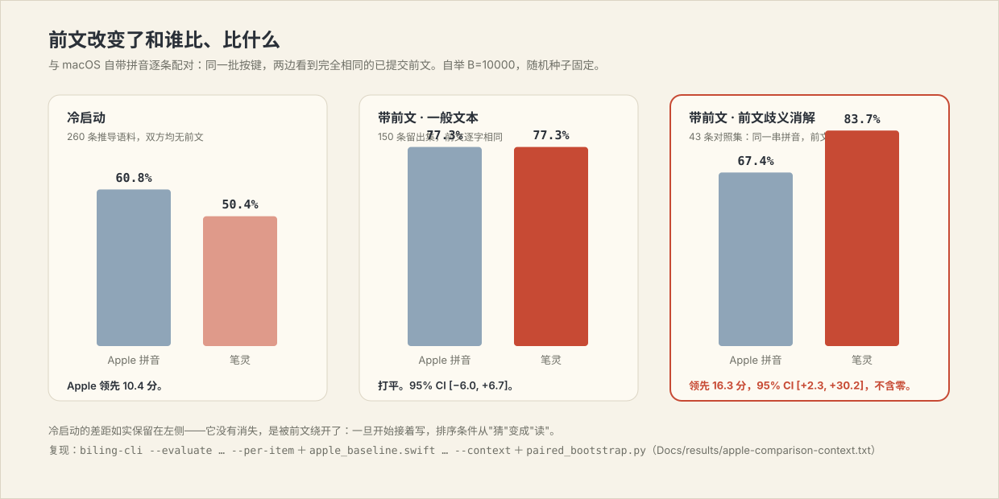

# 笔灵 BiLing

**简体中文** · [English](README_EN.md)


笔灵是一个 macOS 原生拼音输入法。词典引擎在毫秒内给出完整候选，本机运行的
Qwen3-0.6B 读取**光标前的真实文本**把候选重排，你的选择在这台 Mac 上加密学习。
整个工程没有网络权限——不是"承诺不上传"，是根本没有上传的路。

试试连打一整句：输入 `jilindaxuelajixuexiao`，第一候选就是
**吉林大学垃圾学校**——词典里并没有这个词条，它是引擎现场拼出、再由模型确认的
结果。也可以像平时打字那样偷懒：`jilindxmeiykongt` → **吉林大学没有空调**。

## 前文是这个输入法的立身之本

传统输入法不管你正在回复什么，同一串拼音永远同一个排序。笔灵读光标前的真实
文本，而且现在是**两层都读**：已提交的末词直接参与词典层解码（替换句首标记，
只升不降，语料没见过的搭配一分不动），模型再在此之上做上下文重排。词典层的
前文是纯查表，不到一毫秒。

| 你写到一半的话 | 接着输入 | 第一候选 |
|---|---|---|
| 走进 | `jiaoshi` | **教室** |
| 我们的 | `jiaoshi` | **教师** |
| 爷爷最喜欢下 | `xiangqi` | **象棋** |
| 我突然 | `xiangqi` | **想起** |
| 依法维护自己的 | `quanli` | **权利** |
| 滥用手中的 | `quanli` | **权力** |

自己复现：

```bash
"$HOME/Library/Input Methods/BiLing.app/Contents/Helpers/biling-cli" \
  --xpc --context "走进" jiaoshi
```

这不只是演示效果，是可测的差距——见下一节的配对对比。

## 它现在有多准

这是最重要的一节，因为它是**实测**，而且不是拿作者自己写的例子测的。

评测语料由一个本系统未参与的过程生成：句子取自公开新闻语料，由 jieba 分词、
pypinyin 注音（两者都不知道笔灵词库的存在），按键串再从打字模型里采样出来。
参数只在 dev 集上标定，test 集只跑一次。

| 条件 | 仅词典 | 完整系统 |
|---|---|---|
| 整串全拼 | 46.1% | **54.4%** |
| 全拼 + 前文 | 61.1% | **68.3%** |
| 轻度缩写 | 24.8% | **34.5%** |
| 缩写 + 前文 | 39.4% | **52.5%** |
| 重度缩写 | 15.7% | **20.4%** |
| **合计（n=1761，带前文）** | 37.8% | **46.1%** |

而且这一版更省电才做到的：一个在留出数据上校准的门控先估计"词典的第一名有多大
概率是错的"，只有值得问的时候才去问模型——test 集上模型只在 **62–68%** 的按键上
运行，准确率不降反升。

**和 macOS 自带拼音比呢？冷启动还差一截，带前文已经平了。** 逐条配对，
同一批按键、两边看到完全相同的前文：



| 条件 | Apple 拼音 | 笔灵 | 结论 |
|---|---|---|---|
| 冷启动（260 条，冻结口径） | **60.8%** | 50.4% | Apple 领先 10.4 分 |
| 带前文 · 一般文本（150 条留出） | 77.3% | 77.3% | 打平，95% CI [−6.0, +6.7] |
| 带前文 · 前文歧义（43 条对照） | 67.4% | **83.7%** | **+16.3 分，95% CI [+2.3, +30.2]** |

冷启动的差距如实写在第一行——它没有消失，是被前文绕开了：一旦开始接着写，
排序条件就从"猜"变成"读"。43 条对照集的置信区间不含零，是这个项目第一个在
统计上站得住的领先；也老实说明：n=43，单机，Apple 自身的学习状态无法重置。
完整方法、命令与逐条数据见 `Docs/results/apple-comparison-context.txt`。


完整方法、消融、误差分析与和已发表结果的对齐，见
**[原理文档 Docs/THEORY.md](Docs/THEORY.md)**——第二部分（§12–§19）就是这一轮：
上下文条件化、个性化证据模型、校准门控，以及一次被发布门当场拦下的回归。

## 安装

### 直接装（推荐）

Apple silicon Mac，macOS 26 或更新。

1. 从 [Releases](https://github.com/shoal-rat/BiLing/releases/latest) 下载
   `BiLing-*-macOS-arm64.zip` 并解压；
2. 右键 `安装笔灵.command`，选"打开"；
3. 安装器会校验模型摘要、启动服务、跑一遍排序检查，然后注册输入源；
4. 在菜单栏输入法菜单里选 **笔灵**。

发布包是 ad-hoc 签名（没有 Apple Developer ID，未经公证）。macOS 弹出验证提示
时，去"系统设置 → 隐私与安全性"确认后选"仍要打开"；不放心就走源码安装，每一行
都在这个仓库里。

### 从源码装

需要 Xcode 26（或对应命令行工具，Swift 6.3+）、Homebrew、Git LFS。

```bash
git lfs install
git clone https://github.com/shoal-rat/BiLing.git
cd BiLing
brew install llama.cpp ggml libomp
./scripts/install.sh
```

安装是**事务化**的：先把现有安装备份，任何一步失败——包括最后那道
"吉林大学垃圾学校 必须排第一"的发布冒烟检查——都会自动回滚到之前的版本并
重新注册。这不是纸面设计：这一轮它在生产里真的拦下过一次回归（模型权重
调过头，模型的风格偏好开始压过语料词频），当场回滚，一次成功的失败。

装完如果输入法菜单里还没有"笔灵"，注销再登录一次——这是 macOS 的输入源缓存，
不是安装失败。

## 它怎么找到好词


关键的取舍：**模型不在按键的必经之路上。**

1. **切分成格。** 按键串解析为音节格，保留全部歧义：`xian` 同时是 先 和
   西安，`fangan` 同时是 方案 和 反感。歧义交给后面消解，不做贪心决定。
2. **查词并连成句。** 144 万词条的索引给出每个片段的候选词；缩写码让
   `dx` → 大学、`meiy` → 没有 也能参与。
3. **前文进解码器。** 光标前刚提交的末词替换掉句首标记，成为第一个词的
   条件；语料见过 走进→教室，教室 就先出。这一步是查表，不花模型的钱。
4. **精确解码。** 前向 Viterbi 算出每个状态的最优分，反向 A\* 按分数严格递减
   取出前 80 条——这保证交给模型的候选表是**真正有序**的，而不是碰巧有序。
5. **该问才问模型。** 校准过的门控用整张列表的形状（边距、熵、拥挤度）估计
   第一名出错的概率，冷启动与带前文各有一套参数；判定"已经定了"的按键直接
   跳过模型。test 集上三分之一的按键不再唤醒 GPU，准确率没有变化。
6. **模型重排。** Qwen3-0.6B 在独立进程里给前 16 个候选打上下文分，异步返回、
   原位重排，新按键一到就原子取消旧请求；单次打分有 2.5 秒墙钟预算，超时就
   按词典排序出货。一个稳定性控制器保证：你已经用方向键选起来的列表不会被
   迟到的分数搬走。
7. **你的习惯最后加权。** 见下一节——这一版的"学习"不止是计数了。

模型进程崩了、还没启动、或者被内存压力收走？词典引擎照常工作，你最多损失
"更懂上下文"的那部分排序，打字本身永远不停。

真实候选窗（AppKit 原生控件，非拼图）：


## 键盘

| 按键 | 动作 |
|---|---|
| `a`–`z`、`'` | 组合拼音 |
| 空格 | 上屏高亮候选 |
| `1`–`9` | 上屏对应编号候选 |
| ← / → | 移动高亮 |
| ↑ / ↓ | 翻页 |
| Return | 原样上屏字母串 |
| Esc | 取消组合 |
| ⌘ / ⌃ / ⌥ 组合键 | 先上屏字面输入，快捷键继续传给应用 |

中文语境下 `,` `.` `?` `!` `:` `;` 自动转全角；中英文相邻自动补空格；两者都能
在设置里关。

**缩写**：整串首字母出词（`jldx` → 吉林大学、`zgrm` → 中国人民），也可以按词
偷懒（`jilindxmeiykongt` → 吉林大学没有空调）。字母串本身是合法全拼时全拼优先，
`fan` 永远是 饭。

**中英混输**不用切换模式：`economicslajizhuanye` → economics 垃圾专业，
`yongvscodexiedaima` → 用 VS Code 写代码。大写字母开头直接进入字面模式，
`iPhone` 不会被强行转换。

## 学习与隐私


学习这一层这一版重写了，值得多说两句：

- **三个时间尺度的记忆**（约 50 / 500 / 5000 次选择的半衰期）：早上刚选的压过
  上个月的习惯，但几个月的老习惯挺得过一周不用——单一衰减速率做不到两头；
- **学词间搭配，不只学词**：整句上屏时句内相邻词对计入你的转移证据，之后按
  证据量插值进解码——跟在某个词后面选够 40 次，你的用法才拿到一半投票权，
  上限七成，语料永远保底。新装机零证据，行为逐字节等于没有这层；
- 所有内容 AES-GCM 加密，密钥在 Keychain，目录排除在 Time Machine 与 iCloud
  备份之外；库里存的是带密钥的哈希索引和密文，拿到文件也读不出你打过什么；
- 这些场景永远不学：Secure Input（密码框）激活时、终端和密码管理器里、长数字、
  URL、邮箱、高熵字符串、以及你用 Return 原样上屏的内容；
- **数据完全是你的**：设置界面能看到每一条、能单删、能清空；
  `biling-cli --export-learning 路径` 把全部学习数据解密导出成 JSON 带走。

### LoRA 个性化（进阶，可选）

```bash
./scripts/train_lora.sh
```

用你的选择记录在本机微调模型，全程离线；删除生成的文件即回退。首次运行会建一个
私有 venv 并下载基座模型与转换依赖。

## 性能与能耗

| 项 | 实测 |
|---|---|
| 输入法进程（未开始输入） | 29.6 MB |
| 引擎进程（词库与 n-gram 已载入） | 124 MB |
| 模型守护进程（模型已载入） | 620 MB，其中约 400 MB 可被系统回收 |
| 空闲 10 分钟后 | ≈ 6 MB（模型整体卸载） |
| 纯拼音候选延迟 | 3.8 ms 中位 |
| 缩写输入候选延迟 | 15–20 ms 中位 |
| 模型重排 | 25–50 ms，异步 |
| 模型调用率 | 62–68% 的按键（门控跳过其余） |

没有任何定时器：不做周期健康检查、不轮询状态。模型懒加载、空闲卸载、
按键更新原子取消上一次打分。低电量模式下自动把会话切给苹果自带拼音。

## 自己验证

```bash
swift test                                                   # 122 项测试
python3 scripts/build_eval_corpus.py --fetch --limit 800     # 生成推导语料
.build/release/biling-cli --evaluate Tests/Corpus/derived-test.tsv
```

```bash
# 词典引擎单独跑（不加载模型）
.build/release/biling-cli --engine-only jilindaxuelajixuexiao
# 已安装的 XPC 服务（和真实输入路径同一条链；守护进程只接受安装包内的客户端）
"$HOME/Library/Input Methods/BiLing.app/Contents/Helpers/biling-cli" \
  --xpc jilindaxuelajixuexiao
# 前文歧义对照集 + 与系统输入法的配对对比（后者会接管键盘几分钟）
.build/release/biling-cli --evaluate Tests/Corpus/contrast.tsv --per-item biling.tsv
swift scripts/apple_baseline.swift Tests/Corpus/contrast.tsv 43 --context > apple.tsv
python3 scripts/paired_bootstrap.py biling.tsv apple.tsv
```

CLI 的排序和输入法用的是同一个混分函数，打印出来的就是你打字时看到的顺序。

## 故障排查

**选了笔灵没反应** —— 重新跑一遍安装器，然后注销登录。

**候选窗一直显示"Qwen · 暂不可用"** —— 词典候选不受影响，可以继续打字。看
`~/Library/Application Support/BiLing/engine.log`；launchd 会自动重启模型进程。

**密码框里打不出字** —— 正常。macOS 在 Secure Input 下会绕过所有第三方输入法。

## 卸载

```bash
./scripts/uninstall.sh
```

App 和两个 LaunchAgent 移到废纸篓。学习数据保留在
`~/Library/Application Support/BiLing`，想一起清的话先在设置里点清除（或先
`--export-learning` 带走）。

## 工程结构

```text
Sources/
├── PinyinLattice/      拼音切分：音节表、切分格、模式判定
├── BackboneEngine/     词典索引、精确格解码、打分模型、候选源协议、
│                       上下文条件化、校准门控、加密学习库 v2
├── InputSessionCore/   纯函数按键路由 + 候选稳定性控制器（可单测）
├── IPCProtocol/        带代次标记的 XPC 协议
├── LLMRanker/          llama.cpp 桥（原子取消、合并分词、超时熔断）
├── BiLingEngine/       模型守护进程：懒加载、空闲卸载、连接校验
├── BiLingApp/          IMKit 控制器、候选窗、设置界面
└── BiLingCLI/          诊断与评测 CLI（--evaluate / --replay / --per-item）
scripts/
├── build_dictionary.py 编译词库（含缩写码与实体表）
├── build_bigrams.py    训练词间转移模型
├── build_eval_corpus.py 生成推导评测语料（支持按来源分离切分）
├── apple_baseline.swift 驱动系统输入法做对比基线（--context 配对前文）
├── paired_bootstrap.py 逐条配对自举置信区间
└── train_lora.sh       本机 LoRA 个性化
data/manifests/         每个数据源的清单：许可证、sha256、用途
```

## 词库、模型与致谢

- 词库：[万象拼音](https://github.com/amzxyz/rime_wanxiang)（CC BY 4.0）与
  [Rime pinyin-simp](https://github.com/rime/rime-pinyin-simp)（Apache-2.0），
  编译成只读 SQLite，144 万余条词条；
- 转移模型训练语料：[Leipzig Corpora Collection](https://wortschatz.uni-leipzig.de/)
  中文新闻与维基百科，169 万句（与评测语料重合的句子已剔除）；
  各数据源的许可证与校验和见 `data/manifests/`；
- 模型：[Qwen3-0.6B-Base](https://huggingface.co/Qwen/Qwen3-0.6B-Base)
  Q4_K_M（Apache-2.0）；
- 解码器形式参考 [libime](https://github.com/fcitx/libime)，缩写门控规则参考
  [librime](https://github.com/rime/librime)。

本项目采用 Apache-2.0 许可，见 [LICENSE](LICENSE) 与 [NOTICE](NOTICE)。
