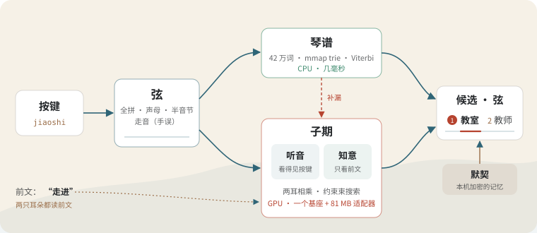
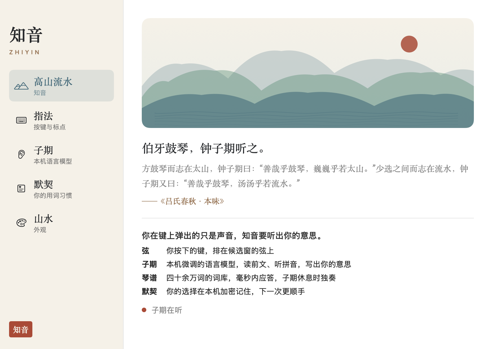

<p align="center">
  
</p>

<h1 align="center">知音 · Zhiyin</h1>

<p align="center"><b>你弹出的只是声音，知音听出你的意思。</b><br>
一个在 Mac 本机运行语言模型的拼音输入法 · 前身为「笔灵 BiLing」</p>

<p align="center"></p>

> 伯牙鼓琴，志在高山，钟子期曰：“巍巍乎若太山。”志在流水，曰：“汤汤乎若流水。”
> ——《吕氏春秋·本味》

拼音只是声音。`shi` 可以是 是、时、事、十、世、市……听懂你前面在说什么，才知道此刻要的是哪一个。
知音就是那个听者：它读光标前的文字、听你敲下的每个键，在本机写出你的意思。整个输入法——名字、
界面、模型、词库——都从「高山流水」这个故事里长出来，见 [世界观](Docs/WORLD.md)。

## 世界

| | 是什么 |
|---|---|
| **弦** | 你按下的键；候选字排在一根弦上，高亮的那段弦变成朱砂色 |
| **子期** | 本机的语言模型，两只耳朵：**听音**（看得见按键）与**知意**（只看前文，判断什么是通顺的中文） |
| **琴谱** | 42 万词的词库，毫秒内应答；子期休息时它独奏 |
| **默契** | 你的选择在本机加密记住，下一次更顺手 |
| **走音** | 手指滑了一下也听得懂：相邻键、颠倒、漏字母、多字母 |
| **琴台** | 设置 |

## 它有多准

和 macOS 自带的简体拼音逐条配对比较：同一批 1119 条留出语料（聊天、新闻、当代用语；训练从未见过），两边看到完全相同的前文，
Apple 由真实按键驱动。下表是**实际装进输入法的配置**（听音 r3+r4 权重平均，束宽 4）。方法见 [第一轮](Docs/results/duel-r2.md)，
历次改进见 [第二轮](Docs/results/duel-r3.md)、[第三轮](Docs/results/duel-r3r4.md)。

| | 知音 | Apple 拼音 | 差（95% CI） |
|---|---|---|---|
| **总体** | **71.8%** | 64.6% | **+7.1** [+4.6, +9.7] |
| 带前文 | **76.2%** | 66.5% | **+9.7** [+6.5, +13.0] |
| 无前文 | **64.0%** | 61.3% | +2.7 [−1.5, +6.9] |
| 新闻 | **73.0%** | 58.4% | **+14.6** |
| 聊天 | 68.3% | 69.2% | −0.8 |
| 当代用语（流行语、中英混杂） | **80.5%** | 71.5% | **+8.9** |
| 整句 | **65.9%** | 54.4% | **+11.5** |
| 轻缩写 / 重缩写 | **47.0% / 50.0%** | 38.0% / 27.9% | +9.0 / **+22.1** |
| 手误 | 45.8% | 44.3% | +1.5 |

老实说：Apple 在**无前文的聊天短句**上仍略胜（−3.0，置信区间含零）。

## 它怎么听

<p align="center"></p>

1. **弦**把按键读成音节：全拼、声母缩写（只在没有全拼读法时）、正在敲的半个音节、以及手误。
2. **琴谱**立刻给出一个能用的候选列表（几毫秒，纯 CPU）。
3. **子期**用两只耳朵逐 token 听：每一步只考虑按键能拼出的 token，两只耳朵的分数相乘（product of experts），
   再扣掉缩写和手误的代价。束搜索的所有假设作为一批送进 GPU，共享前文的 KV 缓存。
4. **琴谱补漏**：词典找到、而束搜索漏掉的读法（人名、成语）也交给两只耳朵打分，放在一起排。
5. **默契**把你以前的选择提上来——只要子期不强烈反对。

为什么是两只耳朵，而不是一个微调模型：见 [结构文档](Docs/ARCHITECTURE.md)。简单说，在一台笔记本能负担的训练量下，
微调学会了"读键"，却丢掉了"语感"；原始模型语感完整，却看不见后面的键。两者相乘，各取所长。

## 安装

Apple silicon Mac，macOS 26 或更新；需要 Xcode 命令行工具与 Homebrew。

```bash
git clone https://github.com/shoal-rat/BiLing.git zhiyin && cd zhiyin
brew install llama.cpp
./scripts/fetch_models.sh      # 下载子期（基座 372 MB + 听音适配器 81 MB），校验 SHA-256
./scripts/install.sh           # 构建、冒烟测试、事务化安装到 ~/Library/Input Methods/知音.app
```

然后在 系统设置 → 键盘 → 输入法 → `+` → 简体中文 里添加 **知音**。卸载：`./scripts/uninstall.sh`
（加 `--forget` 同时清除默契）。

## 键盘

| 按键 | 作用 |
|---|---|
| 字母、`'` | 拨弦（`'` 分隔音节：`xi'an` → 西安） |
| 空格 / `1`–`9` | 选定高亮 / 对应编号的候选；只读了一部分键的候选会留下剩余的键继续组合 |
| ← → Tab | 沿弦移动 |
| ↑ ↓ `-` `=` | 翻页 |
| Return | 原样上屏字母 |
| Esc | 取消 |
| 轻点 Shift | 中 / 英（光标旁浮现一方小印） |

中文标点自动全角；数字后的 `.` `,` `:` 保持半角（3.14、12:30）。

## 能耗与速度

| 项 | 实测（M5 / 16 GB，Metal） |
|---|---|
| 琴谱一次查询 | 1–5 ms（CPU） |
| 子期一次整句查询 | 束宽 4：p50 135 ms，p95 342 ms（连打时新按键在下一步之间打断旧搜索，多数中间搜索不跑完） |
| 内存 | 基座 372 MB（mmap，可回收）+ 听音适配器 81 MB + KV 缓存 |
| 闲置 | 模型释放，0 GPU、0 定时器 |

- 子期只在你按键时工作，没有任何定时轮询；新按键在下一步之间打断旧搜索。
- 闲置 15 分钟（可调）释放模型；下一个键约 0.5 秒唤醒。
- 「轻听」束宽减半；低电量模式默认独奏（只用琴谱）。
- 空闲时界面一像素不动：只有子期正在听时，弦才会轻颤不到一秒。

## 琴台

<p align="center"></p>

五个房间：**高山流水**（故事与子期的状态）、**指法**（Shift 切换、标点、每页候选数）、**子期**（细听 / 轻听、读前文、
低电量独奏、闲置释放）、**默契**（你的用词记忆：搜索、单删、全部忘记、导出）、**山水**（宣纸 / 夜山、清雅 / 墨韵 / 楷书、字号，
实时预览候选窗）。

## 学习与隐私

一切在本机。默契用 AES-GCM 加密，密钥在钥匙串，目录不进 Time Machine；在琴台里可以搜索、单删、全部忘记、导出 JSON。
密码框（Secure Input）、网址、邮箱、长数字从不学习。前文只在本次组合中使用，切换应用即清空。工程没有任何网络代码。

## 斫琴：自己训练子期

```bash
python3 -m venv .venv && .venv/bin/pip install mlx-lm jieba pypinyin tokenizers torch transformers safetensors
python Tools/zhuoqin/make_dataset.py --out work/data --per-source 160000
python Tools/zhuoqin/make_xinci.py   --out work/data_xinci
python Tools/zhuoqin/train.py --data work/data --out work/runs/mine
python Tools/zhuoqin/export_lora.py work/runs/mine --out Models/ziqi-tingyin.gguf
```

M5 / 16 GB 上约 1000 token/s，一轮约 3 小时。新词包（流行语、中英混杂、近年新词）在 `Tools/zhuoqin/xinci/`，欢迎补充。

## 调音：评测与诊断

```bash
.build/release/tiaoyin listen --context 走进 jiaoshi            # 子期怎么听
.build/release/tiaoyin score jilindxmeiykongt                   # 琴谱怎么读
python Tools/duel/build_duel_set.py                             # 生成对弈集
.build/release/tiaoyin eval Tests/Corpus/duel-test.tsv --per-item zhiyin.tsv
swift Tools/duel/duel.swift Tests/Corpus/duel-test.tsv 5000 --context > apple.tsv   # 会接管键盘
python Tools/duel/compare.py zhiyin.tsv apple.tsv
```

## 工程结构

```text
Sources/
├── ZhiyinCore/       弦 KeyReader · 琴谱 Qinpu/Trie · 默契 Moqi · 候选编排 Composer
├── ZhiyinListener/   子期：两耳约束束搜索（llama.cpp，Metal）、ListenerService
├── ZhiyinIME/        知音.app：IMK 控制器、弦（候选窗）、琴台、主题
├── Tiaoyin/          调音 CLI
└── CLlama/           llama.h 的 Swift 桥
Tools/
├── zhuoqin/          斫琴：读音表、样本生成、MLX 训练、参考解码器、导出、新词包
├── duel/             对弈：对弈集生成、驱动任意输入法的测试工具、配对比较
└── brand/            图标绘制
Resources/Data/       琴谱 trie、子期词表 trie、读音表
Docs/                 世界观、结构、评测结果
```

## 致谢与许可

- 基座模型 [Qwen3-0.6B-Base](https://huggingface.co/Qwen/Qwen3-0.6B-Base)（Apache-2.0）；推理 [llama.cpp](https://github.com/ggml-org/llama.cpp)；训练 [MLX](https://github.com/ml-explore/mlx)。
- 词库 [万象拼音](https://github.com/amzxyz/rime_wanxiang)（CC BY 4.0）与 [Rime pinyin-simp](https://github.com/rime/rime-pinyin-simp)（Apache-2.0）。
- 语料：[LCCC](https://github.com/thu-coai/CDial-GPT)（MIT）、[Leipzig Corpora Collection](https://wortschatz.uni-leipzig.de/)。
- 图标的水墨稿由 Codex 图像生成绘制，矢量菜单图标由 `Tools/brand/draw_icons.swift` 绘制。

Apache-2.0，见 [LICENSE](LICENSE) 与 [NOTICE](NOTICE)。
