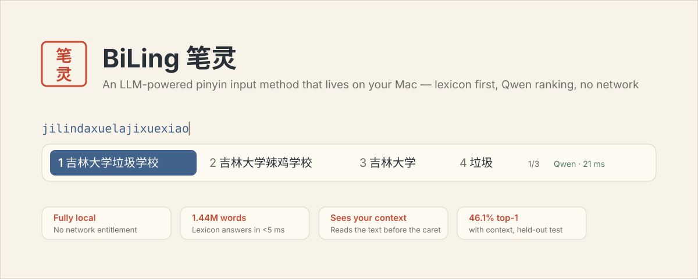
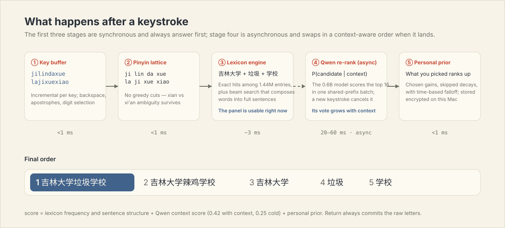
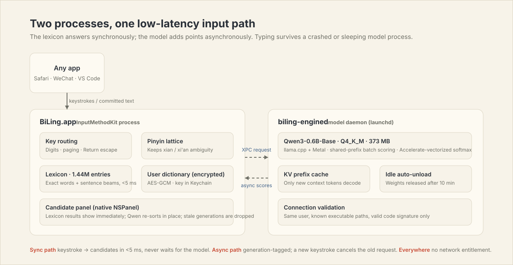
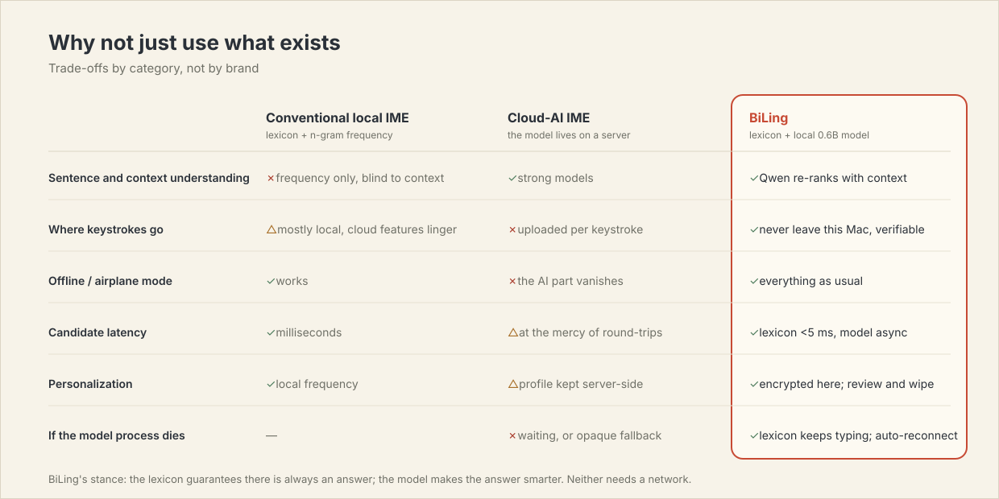
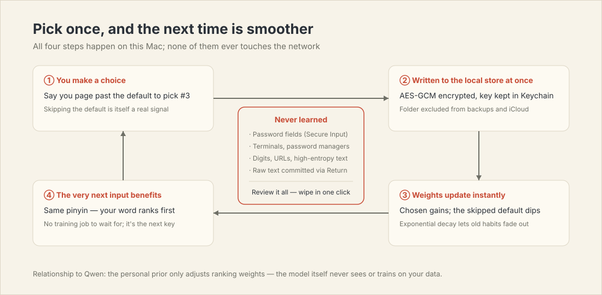

# BiLing 笔灵

[简体中文](README.md) · **English**



BiLing is a native macOS pinyin input method. A lexicon engine produces the
full candidate list within a few milliseconds; a Qwen3-0.6B running on your
Mac re-ranks those candidates by context; and your choices are learned,
encrypted, on this machine. The project has no network entitlement — it is
not a promise not to upload, there is simply no code path that could.

Try a whole sentence in one go: type `jilindaxuelajixuexiao` and the first
candidate is **吉林大学垃圾学校** — that phrase is not a dictionary entry;
the engine composes 吉林大学 + 垃圾 + 学校 on the spot and the model
confirms the order. Press Space to commit.

## Install

### Prebuilt (recommended)

Apple silicon Mac, macOS 26 or newer.

1. Download `BiLing-1.3.0-macOS-arm64.zip` from the
   [latest release](https://github.com/shoal-rat/BiLing/releases/latest)
   and unzip it;
2. Control-click `安装笔灵.command`, choose Open;
3. The installer verifies the model checksum, starts the services, runs the
   `jilindaxuelajixuexiao → 吉林大学垃圾学校` ranking check, and registers
   the input source;
4. Pick **笔灵** from the input menu in the menu bar.

The release is ad-hoc signed (no Apple Developer ID, not notarized). If
macOS shows a verification prompt, confirm it under System Settings →
Privacy & Security and choose Open Anyway — or build from source; every
line is in this repository.

### From source

Requires Xcode 26 (or matching Command Line Tools, Swift 6.3+), Homebrew,
and Git LFS.

```bash
git lfs install
git clone https://github.com/shoal-rat/BiLing.git
cd BiLing
brew install llama.cpp ggml libomp
./scripts/install.sh
```

The script builds three executables, assembles a self-contained
`BiLing.app` (model, lexicon, and llama.cpp dylibs included), installs it
into `~/Library/Input Methods`, sets up two login agents, and then runs the
full smoke suite against the actual installed artifacts — if any step
fails, your existing installation is left untouched. The previous version
is backed up under `~/Library/Application Support/BiLing/Backups`.

If 笔灵 does not appear in the input menu right away, log out and back in
once — that is macOS's input-source cache, not a failed install.

## How it finds good words



The load-bearing decision: **the model is never on the keystroke's critical
path.**

1. Keystrokes enter the pinyin lattice. Segmentation makes no greedy cuts —
   `xian` keeps both 先 and 西安 alive, and `'` forces a boundary by hand;
2. The lexicon engine queries a 1.44M-entry index immediately: whole words
   hit directly, and everything else goes through a beam search that stitches
   words into full sentences (that is where 吉林大学垃圾学校 comes from).
   About 3 ms on an M5 — the candidate panel is already usable;
3. Qwen3-0.6B, in its own process, scores the top 16 candidates against
   context. Context comes first from **the real text before the caret in
   the field you are typing in** (read once from the host app at the start
   of each composition, up to 600 characters; clients that cannot provide
   it, like Terminal, fall back to this session's committed text) — reply
   to an email, and the model sees that email. This is asynchronous: scores
   re-sort the panel in place when they arrive, a new keystroke cancels the
   old request, and stale replies are dropped;
4. Your selection history weighs in last: chosen words move up, defaults
   you paged past drift down slightly, and the weights decay over time.

If the model process crashes, has not started yet, or was reclaimed under
memory pressure, the lexicon keeps working — you lose only the
context-aware part of the ordering, never the ability to type.

### Same pinyin, two different sentences

This is the thing conventional IMEs cannot do: they rank the same pinyin
the same way no matter what you are replying to. BiLing reads the real
text before your caret, so the first candidate follows your sentence —
every row below is measured output from the installed build:

| Text you have half-written | Then you type | First candidate |
|---|---|---|
| 他这辈子行医救人，是一位好 | `yisheng` | **医生** (doctor) |
| 这句话让我受用 | `yisheng` | **一生** (a lifetime) |
| 我突然 | `xiangqi` | **想起** (recall) |
| 爷爷最喜欢下 | `xiangqi` | **象棋** (chess) |
| 我们在化学课上做 | `shiyan` | **实验** (experiment) |
| 他违背了当初的 | `shiyan` | **誓言** (vow) |

Reproduce it yourself (`--context` stands in for the text already in the
field):

```bash
"$HOME/Library/Input Methods/BiLing.app/Contents/Helpers/biling-cli" \
  --xpc --context "爷爷最喜欢下" xiangqi
```

The actual candidate panel (native AppKit controls, not a mockup):


## How the processes divide the work



`BiLing.app` is the InputMethodKit process and does only latency-sensitive
work: key routing, segmentation, lexicon queries, the candidate panel, and
commits. `biling-engined` is a launchd-managed daemon that owns the single
copy of the model weights for all input sessions; it accepts XPC
connections only from the same user, from known installed executable
paths, with a valid code signature. Every request carries a generation
tag, and whichever is stale gets dropped — an async result can never land
in another window.

## Why build another one



- Conventional local IMEs are fast and dependable, but they rank purely by
  frequency and never look at the text already in your field. For the six
  rows in the table above, they can only ever give three fixed answers;
- Cloud-AI IMEs understand context, at the cost of streaming every
  keystroke to someone else's server — and degrading offline;
- BiLing puts the two together on one machine: lexicon speed, model
  judgment. A 0.6B model is plenty for "pick the best of a handful of
  pinyin-matched candidates" — a far easier job than free generation.

For the full scoring formulas, beam-search details, and measured
latency/memory charts, see **[Docs/THEORY.md](Docs/THEORY.md)**
(Chinese, with an English abstract).

## Learning and privacy



- Every eligible selection is written to a local store immediately:
  AES-GCM encrypted, key in the Keychain, directory excluded from Time
  Machine and iCloud backups;
- What is stored is a count of "for this pinyin you chose this word", never
  a keystroke stream;
- These are never learned: anything while Secure Input is active (password
  fields), anything typed in terminals or password managers, long digit
  runs, URLs, email-like strings, high-entropy literals, and raw text you
  committed with Return;
- 笔灵设置 → 学习与隐私 lists every learned item and clears all of them in
  one click.

## Keyboard

| Key | Action |
|---|---|
| `a`–`z`, `'` | Compose pinyin |
| Space | Commit the highlighted candidate |
| `1`–`9` | Commit the numbered candidate |
| ← / → | Move the highlight |
| ↑ / ↓ | Page candidates |
| Return | Commit the raw letters as typed |
| Esc | Cancel the composition |
| ⌘ / ⌃ / ⌥ shortcuts | Commit the literal input first, then pass the shortcut through |

In a Chinese context, `,` `.` `?` `!` `:` `;` become full-width; a space is
inserted automatically where Chinese meets Latin. Both are toggleable in
settings.

Latin script inside a sentence needs no mode switch. Recognition has three
layers:

- **A curated table** (~260 entries, with proper casing restored): AI and
  company names (`claude → Claude`, `openai → OpenAI`,
  `chatgpt → ChatGPT`), tech and finance abbreviations (`ai → AI`,
  `gdp → GDP`, `ipo → IPO`), Chinese-internet slang written in Latin
  letters (`xswl`, `yyds`, `emo`, `ddl`), and common English given names
  (`tom → Tom`, `emma → Emma`);
- **The system word list**: every other English word comes from macOS's
  own 200k-word dictionary, loaded lazily in the background on first use;
- **Ranking policy**: when the letters are also valid pinyin, Chinese wins —
  `ai` still puts 爱 first with AI a few slots down, `fan` is 饭 not fan;
  but for a key no real word owns, like `openai`, OpenAI ranks first
  instead of losing to a force-stitched 哦喷爱.

A leading capital letter switches to literal composition, so `iPhone` is
never force-converted. The 中/英 key follows system semantics: BiLing
registers as a non-Latin Simplified Chinese source and participates in
Caps Lock switching exactly like Apple's pinyin.

## Performance and energy

An input method is a permanent background process; being frugal matters as
much as being fast:

- **Sync path**: lattice + lexicon + personal prior run in-process; a
  21-key sentence takes about 3 ms;
- **Async path**: Qwen scores all candidates in one shared-prefix batch;
  softmax is vectorized with Accelerate; the committed context's KV cache
  is reused across keystrokes so only new tokens are ever decoded;
- **No polling**: there is no periodic health check — status refreshes on
  demand, and reconnects use exponential backoff;
- **It sleeps**: after 10 idle minutes the model is unloaded entirely and
  the daemon drops to a few MB; the next keystroke brings it back in under
  a second via mmap, with the lexicon covering the gap;
- **Low Power Mode steps aside**: when the system battery saver is on,
  BiLing hands the session straight to Apple's built-in pinyin (and if
  that source is not enabled, falls back to lexicon-only ranking with no
  model calls);
- **mmap'd weights**: the 373 MB Q4_K_M file is paged in on demand, and the
  system can reclaim clean pages under memory pressure.

How does it compare with Apple's built-in pinyin on battery? Honestly:
**idle, both are near zero** (BiLing never polls and unloads its model);
**while actively typing, BiLing costs more** — each keystroke adds one
batched 0.6B scoring pass, a ~20–30 ms GPU burst on an M5. That is the
direct price of context-aware ranking, a step Apple's pinyin does not
have. The absolute difference is small (typing is not a sustained load) —
and when saving power actually matters, you don't have to choose: in Low
Power Mode BiLing switches the session to Apple pinyin by itself.

## Verify it yourself

```bash
swift test    # 22 tests: segmentation ambiguity, heteronyms, learning,
              # privacy guard, and the README-example regression
```

```bash
# Lexicon engine alone (no model load)
.build/release/biling-cli --engine-only jilindaxuelajixuexiao

# Full chain, model loaded in-process
.build/release/biling-cli jilindaxuelajixuexiao

# The installed XPC service (same path real typing uses)
"$HOME/Library/Input Methods/BiLing.app/Contents/Helpers/biling-cli" \
  --xpc jilindaxuelajixuexiao
```

The CLI blends scores with the same function the input method uses, so
what it prints is the order you would see while typing.

Logs:

```bash
log show --last 10m --predicate 'subsystem == "com.biling.inputmethod.BiLing"' --style compact
tail -n 100 "$HOME/Library/Application Support/BiLing/engine.log"
```

## Troubleshooting

**Nothing happens after selecting 笔灵** — re-run the installer (it
verifies the whole chain before replacing anything), then log out and in.

**The panel keeps showing "Qwen · 暂不可用"** — lexicon candidates are
unaffected; keep typing. Check `engine.log`; launchd restarts the model
process and the client reconnects automatically.

**The 中/英 key behaves wrongly** — the system still holds old
input-source metadata; reinstall, then log out and in.

**Can't type in password fields** — expected. macOS bypasses third-party
input methods under Secure Input; switch to ABC for the password.

## Uninstall

```bash
./scripts/uninstall.sh
```

The app and both LaunchAgents move to the Trash (recoverable). Learning
data stays in `~/Library/Application Support/BiLing`; clear it from
settings first if you want it gone too.

## Project layout

```text
Sources/
├── PinyinLattice/      Pinyin segmentation: syllable table, lattice, mode detection
├── BackboneEngine/     SQLite lexicon, sentence beams, English lexicon, encrypted learning, blending
├── InputSessionCore/   Pure-function key routing (unit-testable)
├── IPCProtocol/        Generation-tagged XPC protocol
├── LLMRanker/          llama.cpp bridge + Qwen ranker (cancel, KV reuse)
├── BiLingEngine/       Model daemon: lazy load, idle unload, peer validation
├── BiLingApp/          IMKit controller, candidate panel, settings UI
└── BiLingCLI/          Diagnostic CLI (--engine-only / --xpc)
```

## Lexicon, model, and credits

- Lexicon: [rime_wanxiang](https://github.com/amzxyz/rime_wanxiang)
  (CC BY 4.0) and [rime-pinyin-simp](https://github.com/rime/rime-pinyin-simp)
  (Apache-2.0), compiled into a 59 MB read-only SQLite index with 1,440,094
  unique entries. Rebuild with `python3 scripts/build_dictionary.py`;
  sources and pinned commits are documented in `Resources/Lexicon/`;
- Model: [Qwen3-0.6B-Base](https://huggingface.co/Qwen/Qwen3-0.6B-Base)
  Q4_K_M (Apache-2.0), distributed via Git LFS, SHA-256-checked by the
  installer;
- Inference: [llama.cpp](https://github.com/ggml-org/llama.cpp) + Metal;
- English completions: macOS's own `/usr/share/dict/words`.

Full license texts ship with the app under `Contents/Resources/Licenses`.
The project itself is Apache-2.0.
