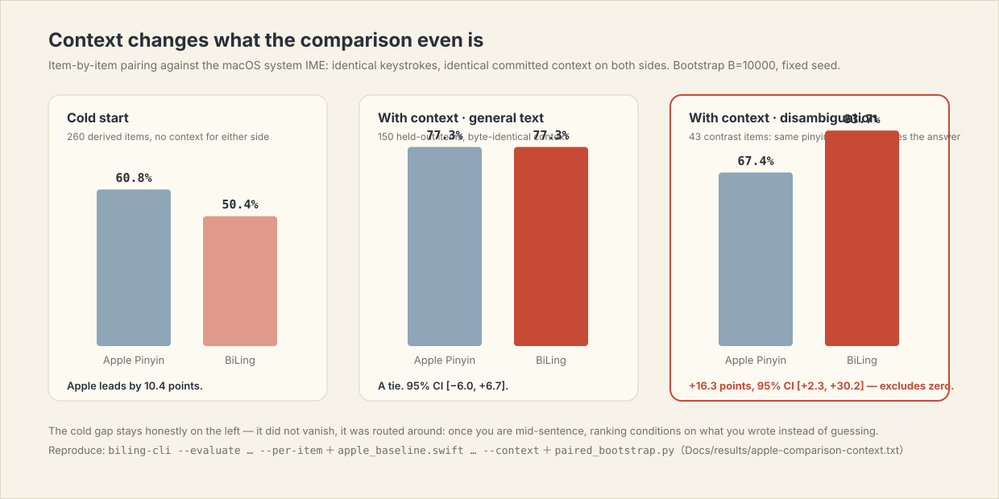

# BiLing 笔灵

[简体中文](README.md) · **English**


BiLing is a native macOS pinyin input method. A lexicon engine produces the full
candidate list in milliseconds, a Qwen3-0.6B running on your Mac re-ranks those
candidates against **the real text before your caret**, and your choices are
learned, encrypted, on this machine. The project has no network entitlement — it
is not a promise not to upload, there is simply no code path that could.

Type a whole sentence at once: `jilindaxuelajixuexiao` gives
**吉林大学垃圾学校** as the first candidate — that phrase is not a dictionary
entry, the engine composes it and the model confirms the ordering. Or be lazy
the way people actually type: `jilindxmeiykongt` → **吉林大学没有空调**.

## Context is the whole point

A conventional input method doesn't care what you are replying to: the same
pinyin always gets the same ordering. BiLing reads the text before your caret,
and it now reads it at **both layers**: the last committed word conditions the
deterministic decoder directly (it substitutes for the sentence-start marker,
promotion-only — pairs the corpus never saw change nothing), and the model
re-ranks on top of that. The deterministic half is a table lookup, under a
millisecond.

| What you've written so far | Then you type | First candidate |
|---|---|---|
| 走进 *(walking into)* | `jiaoshi` | **教室** *(classroom)* |
| 我们的 *(our)* | `jiaoshi` | **教师** *(teacher)* |
| 爷爷最喜欢下 | `xiangqi` | **象棋** *(chess)* |
| 我突然 | `xiangqi` | **想起** *(recalled)* |
| 依法维护自己的 | `quanli` | **权利** *(rights)* |
| 滥用手中的 | `quanli` | **权力** *(power)* |

Reproduce it yourself:

```bash
"$HOME/Library/Input Methods/BiLing.app/Contents/Helpers/biling-cli" \
  --xpc --context "走进" jiaoshi
```

This is not a demo effect; it is a measurable gap — see the paired comparison
below.

## How accurate is it

This is the most important section, because it is *measured*, and not against
examples the author picked.

The evaluation corpus is generated by a process this project had no hand in:
sentences come from a public news corpus, jieba segments them and pypinyin reads
them — neither knows BiLing's lexicon exists — and the keystrokes are sampled
from a typing model. Parameters are tuned on a dev split; the test split is run
once.

| Condition | Lexicon only | Full system |
|---|---|---|
| Full pinyin | 46.1% | **54.4%** |
| Full pinyin + context | 61.1% | **68.3%** |
| Lightly abbreviated | 24.8% | **34.5%** |
| Abbreviated + context | 39.4% | **52.5%** |
| Heavily abbreviated | 15.7% | **20.4%** |
| **Overall (n=1761, with context)** | 37.8% | **46.1%** |

And this version got there while using *less* energy: a gate calibrated on
held-out data estimates how likely the lexicon's first choice is to be wrong,
and only asks the model when it's worth asking — on the test set the model runs
on **62–68%** of keystrokes, with accuracy up, not down.

**Against macOS's own pinyin? Still behind cold — level once there's context.**
Item-by-item pairing, identical keystrokes, identical committed context on both
sides:



| Condition | Apple Pinyin | BiLing | Verdict |
|---|---|---|---|
| Cold start (260 items, frozen) | **60.8%** | 50.4% | Apple by 10.4 points |
| With context · general (150 held-out) | 77.3% | 77.3% | A tie, 95% CI [−6.0, +6.7] |
| With context · disambiguation (43 items) | 67.4% | **83.7%** | **+16.3 pts, 95% CI [+2.3, +30.2]** |

The cold gap sits honestly in the first row — it did not vanish, it was routed
around: once you are mid-sentence, ranking conditions on what you wrote instead
of guessing. The contrast corpus's confidence interval excludes zero — the
first statistically supported lead in this project — and the caveats are stated
just as plainly: n=43, one machine, Apple's own learning state cannot be reset.
Full method, commands, and per-item data:
`Docs/results/apple-comparison-context.txt`.


Full method, ablations, error analysis, and alignment with published results:
**[Docs/THEORY.md](Docs/THEORY.md)** (Chinese, with an English abstract).
Part II (§12–§19) is this round: context conditioning, the personalization
evidence model, calibrated gating — and one regression the release gate caught
in the act.

## Install

### Prebuilt (recommended)

Apple silicon Mac, macOS 26 or newer.

1. Download `BiLing-*-macOS-arm64.zip` from
   [Releases](https://github.com/shoal-rat/BiLing/releases/latest) and unzip;
2. Right-click `安装笔灵.command`, choose "Open";
3. The installer verifies the model digest, starts the services, runs a ranking
   check, and registers the input source;
4. Pick **笔灵** in the menu-bar input menu.

The release is ad-hoc signed (no Apple Developer ID, not notarized). When macOS
prompts, confirm under System Settings → Privacy & Security; if that bothers
you, install from source — every line is in this repository.

### From source

Requires Xcode 26 (or matching CLT, Swift 6.3+), Homebrew, Git LFS.

```bash
git lfs install
git clone https://github.com/shoal-rat/BiLing.git
cd BiLing
brew install llama.cpp ggml libomp
./scripts/install.sh
```

The install is **transactional**: your existing installation is backed up
first, and any failure — including the final release smoke check that
`jilindaxuelajixuexiao` must rank 吉林大学垃圾学校 first — rolls everything
back and re-registers the previous version. Not a paper design: this round it
caught a real regression in production (a model weight swept too far, style
preference starting to outvote corpus frequency) and rolled back on the spot.

If 笔灵 doesn't appear in the input menu after installing, log out and back in
once — that's macOS's input-source cache, not a failed install.

## How it finds the right words


The key trade: **the model is not on the keystroke path.**

1. **Segment into a lattice.** The keystrokes parse into a syllable lattice
   that keeps every ambiguity: `xian` is both 先 and 西安, `fangan` both 方案
   and 反感. Nothing is decided greedily.
2. **Look up words, compose sentences.** A 1.44M-entry index yields candidates
   per span; abbreviation codes let `dx` → 大学 and `meiy` → 没有 join in.
3. **Context enters the decoder.** The word you just committed replaces the
   sentence-start marker as the first transition's condition; if the corpus has
   seen 走进→教室, 教室 comes first. A table lookup — none of the model's
   budget is spent.
4. **Exact decoding.** Forward Viterbi computes exact best scores; backward A\*
   extracts the top 80 in strictly decreasing order — so the list handed to the
   model is *provably* ordered, not accidentally ordered.
5. **Ask the model only when it's worth it.** A calibrated gate reads the shape
   of the whole list (margin, entropy, crowding) and estimates the probability
   the first candidate is wrong — one parameter set for cold lists, another for
   context-shaped ones. A third of keystrokes never wake the GPU; accuracy is
   unchanged.
6. **Model re-rank.** Qwen3-0.6B scores the top 16 candidates in a separate
   process, asynchronously; a new keystroke atomically cancels the old request,
   and a 2.5 s wall-clock budget means a slow call ships the lexicon order
   rather than a stall. A stability controller guarantees a list you've started
   navigating is never reshuffled under your fingers by a late reply.
7. **Your habits weigh in last.** See the next section — "learning" is more
   than a counter now.

Model process crashed, not yet started, reclaimed under memory pressure? The
lexicon engine keeps working; you lose only the context-aware part of the
ranking, never the ability to type.

The real candidate panel (native AppKit, not a mock-up):


## Keyboard

| Key | Action |
|---|---|
| `a`–`z`, `'` | compose pinyin |
| Space | commit highlighted candidate |
| `1`–`9` | commit numbered candidate |
| ← / → | move highlight |
| ↑ / ↓ | page |
| Return | commit the raw letters |
| Esc | cancel composition |
| ⌘ / ⌃ / ⌥ chords | commit literal input first, then pass the shortcut through |

In Chinese context `,` `.` `?` `!` `:` `;` convert to full-width; a space is
inserted between adjacent Chinese and Latin. Both are settings.

**Abbreviations**: whole-string initials (`jldx` → 吉林大学, `zgrm` → 中国人民)
and per-word laziness (`jilindxmeiykongt` → 吉林大学没有空调). When the letters
are also valid full pinyin, full pinyin wins: `fan` is always 饭.

**Mixed Chinese-English** needs no mode switch: `economicslajizhuanye` →
economics 垃圾专业, `yongvscodexiedaima` → 用 VS Code 写代码. A leading capital
enters literal mode — `iPhone` is never force-converted.

## Learning and privacy


The learning layer was rewritten this round, and it's worth the detail:

- **Memory on three timescales** (half-lives around 50 / 500 / 5000
  selections): this morning's pick beats last month's habit, but a months-old
  habit survives a week away — no single decay rate can do both;
- **It learns your word pairs, not just words**: committing a sentence records
  its adjacent word pairs as transition evidence, interpolated into decoding by
  how much evidence exists — your usage earns half the vote only after ~40
  commits behind a given word, capped at 70%, the corpus always keeps a floor.
  A fresh profile has zero evidence and behaves byte-identically to having no
  such layer at all;
- Everything is AES-GCM encrypted, key in the Keychain, directory excluded from
  Time Machine and iCloud backup; the database stores keyed hashes and
  ciphertext, so the file alone reveals nothing you typed;
- It never learns in these situations: Secure Input (password fields),
  terminals and password managers, long digit runs, URLs, emails, high-entropy
  strings, or anything you committed literally with Return;
- **The data is yours**: the Settings window shows every entry, deletes one, or
  clears all; `biling-cli --export-learning path` exports everything, decrypted,
  as JSON.

### LoRA personalization (advanced, optional)

```bash
./scripts/train_lora.sh
```

Fine-tunes the model on your own selection history, entirely offline; delete
the generated files to roll back. First run creates a private venv and
downloads the base model and conversion tooling.

## Performance and energy

| Item | Measured |
|---|---|
| Input-method process (idle) | 29.6 MB |
| Engine process (lexicon + n-grams loaded) | 124 MB |
| Model daemon (model loaded) | 620 MB, ~400 MB reclaimable |
| After 10 min idle | ≈ 6 MB (model fully unloaded) |
| Plain-pinyin candidate latency | 3.8 ms median |
| Abbreviated-input latency | 15–20 ms median |
| Model re-rank | 25–50 ms, asynchronous |
| Model invocation rate | 62–68% of keystrokes (the gate skips the rest) |

No timers anywhere: no periodic health checks, no polling. The model
lazy-loads, unloads when idle, and every keystroke atomically cancels the
previous scoring call. Low Power Mode hands the session to Apple's own pinyin.

## Verify it yourself

```bash
swift test                                                   # 122 tests
python3 scripts/build_eval_corpus.py --fetch --limit 800     # derived corpus
.build/release/biling-cli --evaluate Tests/Corpus/derived-test.tsv
```

```bash
# lexicon engine alone (no model)
.build/release/biling-cli --engine-only jilindaxuelajixuexiao
# the installed XPC service (same chain as real typing; the daemon only
# accepts clients from inside the installed bundle)
"$HOME/Library/Input Methods/BiLing.app/Contents/Helpers/biling-cli" \
  --xpc jilindaxuelajixuexiao
# contrast corpus + the paired Apple comparison (takes the keyboard briefly)
.build/release/biling-cli --evaluate Tests/Corpus/contrast.tsv --per-item biling.tsv
swift scripts/apple_baseline.swift Tests/Corpus/contrast.tsv 43 --context > apple.tsv
python3 scripts/paired_bootstrap.py biling.tsv apple.tsv
```

The CLI ranks with the same blend function the input method uses: what it
prints is the order you see while typing.

## Troubleshooting

**Selected 笔灵 but nothing happens** — run the installer again, then log out
and back in.

**The panel says "Qwen · unavailable"** — lexicon candidates are unaffected;
keep typing. Check `~/Library/Application Support/BiLing/engine.log`; launchd
restarts the model process automatically.

**Can't type in password fields** — correct. macOS bypasses all third-party
input methods under Secure Input.

## Uninstall

```bash
./scripts/uninstall.sh
```

Moves the app and both LaunchAgents to the Trash. Learning data stays in
`~/Library/Application Support/BiLing`; clear it in Settings first (or take it
with you via `--export-learning`).

## Project layout

```text
Sources/
├── PinyinLattice/      segmentation: syllable inventory, lattice, mode detection
├── BackboneEngine/     lexicon index, exact lattice decoding, score model,
│                       candidate-source protocol, context conditioning,
│                       calibrated gate, encrypted learning store v2
├── InputSessionCore/   pure keystroke routing + candidate stability controller
├── IPCProtocol/        generation-stamped XPC protocol
├── LLMRanker/          llama.cpp bridge (atomic cancel, merged tokenization,
│                       timeout fuse)
├── BiLingEngine/       model daemon: lazy load, idle unload, connection vetting
├── BiLingApp/          IMKit controller, candidate panel, settings UI
└── BiLingCLI/          diagnostics and evaluation CLI (--evaluate / --replay /
                        --per-item)
scripts/
├── build_dictionary.py compile the lexicon (abbreviation codes, entity table)
├── build_bigrams.py    train the transition model
├── build_eval_corpus.py derived evaluation corpora (source-separated splits)
├── apple_baseline.swift drive the system IME as a baseline (--context pairs
│                        committed context)
├── paired_bootstrap.py paired bootstrap confidence intervals
└── train_lora.sh       on-device LoRA personalization
data/manifests/         one manifest per data source: licence, sha256, role
```

## Lexicon, model, credits

- Lexicon: [rime-wanxiang](https://github.com/amzxyz/rime-wanxiang) (CC BY 4.0)
  and [rime-pinyin-simp](https://github.com/rime/rime-pinyin-simp)
  (Apache-2.0), compiled into read-only SQLite, 1.44M+ entries;
- Transition-model corpus:
  [Leipzig Corpora Collection](https://wortschatz.uni-leipzig.de/) Chinese news
  and Wikipedia, 1.69M sentences (evaluation overlap excluded); per-source
  licences and checksums in `data/manifests/`;
- Model: [Qwen3-0.6B-Base](https://huggingface.co/Qwen/Qwen3-0.6B-Base)
  Q4_K_M (Apache-2.0);
- Decoder form follows [libime](https://github.com/fcitx/libime); abbreviation
  gating follows [librime](https://github.com/rime/librime).

Licensed Apache-2.0 — see [LICENSE](LICENSE) and [NOTICE](NOTICE).
